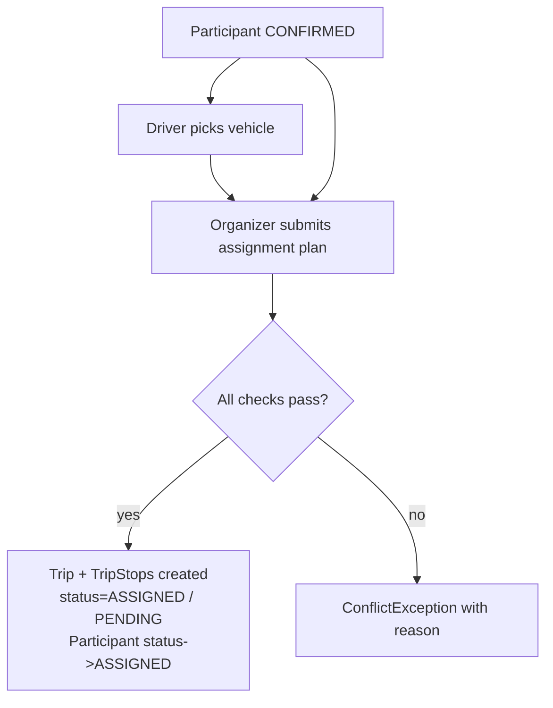
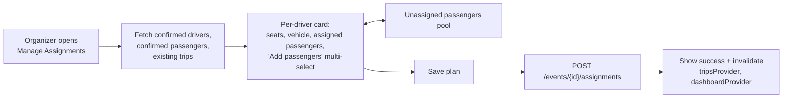

# Phase 3A — Manual Trip Planning Foundation

## 1. Implementation plan

### Backend (Spring Boot)

Five new feature workflows added to existing packages — `vehicle`, `participant` (vehicle linkage), `assignment` (new sub-package under `event`), `trip`, `tripstop`. Pattern is identical to Phase 2:

- Manual `@Component` mappers (no MapStruct).
- Java `record` DTOs in `dto/` per feature.
- Imperative authorization in services using `CurrentUser.require().getId()` + `EventService.requireOrganizer(...)` + new `requireParticipantOwner(...)` / `requireVehicleOwner(...)` helpers.
- `ConflictException` / `ForbiddenException` / `NotFoundException` for domain failures.
- `ApiResponse.ok(...)` envelopes in controllers, `@Valid` on request bodies.
- `ddl-auto=update` continues to manage schema (no Flyway in this phase — `application.yml` keeps current setting).

Order of work:

1. **VehicleService + VehicleMapper + Vehicle DTOs** → wire real implementations into the existing stub `VehicleController`. Add `existsByVehicleId` queries to `EventParticipantRepository` and `TripRepository` for safe delete.
2. **Driver vehicle linkage** → new endpoint on `EventParticipantController`; service validates `role == DRIVER`, vehicle ownership, status ∈ {APPROVED, CONFIRMED}.
3. **Assignment workflow** → new `AssignmentController` + `AssignmentService` + DTOs. One atomic full-replace endpoint (`POST /events/{id}/assignments`) that wipes prior trips for the event and recreates them.
4. **Trip + TripStop creation** delegated from `AssignmentService` (via a small package-private helper). One Trip per driver, stops in submitted order, status defaults preserved (`TripStatus.ASSIGNED`, `StopStatus.PENDING`).
5. **Participant status side-effect** → assigned passengers + drivers transition `CONFIRMED → ASSIGNED`; replaced participants who fall out go back to `CONFIRMED`.
6. **TripService (read APIs)** → wire `TripController.listForEvent` and `TripController.get` to real data; add `GET /api/v1/users/me/trips` to `UserController` (delegates to `TripService.listMyTrips`).
7. **Trip lifecycle endpoints** (`/trips/{id}/start`, `/complete`, `/stops/{id}` PATCH) → keep as 501 stubs for Phase 3B; document as TODOs.

### Frontend (Flutter)

Follows existing `features/<x>/data + presentation` layout, hand-written DTOs, `Dio` API class + co-located `Provider`/`FutureProvider.autoDispose.family`, `Form` + SnackBar UX, route added to `route_paths.dart` + `app_router.dart`.

1. **Vehicle module** (new `features/vehicle/`): list, create, edit, delete with confirmation.
2. **Driver vehicle picker** in `EventDetailScreen` → small `BottomSheet` shown from the existing `_MyParticipationCard` when the user's row has `role == DRIVER` and no vehicle.
3. **Organizer assignment screen** (new `features/assignment/`): grouped list of confirmed drivers; each shows seat count, current passengers, and an "Assign passengers" multi-select dialog pulling from confirmed passengers not yet on any trip; "Save plan" submits the full-replace payload.
4. **Trip module** (new `features/trip/`): `TripResponse` DTOs, `TripApi`, providers, and three view-only screens — `MyTripsScreen` at `/trips`, refactored `DriverTripScreen` and `PassengerRideScreen` connected to real data. Plus an "Event trips" list reused by organizers from event detail.
5. **Wiring**: profile → "My vehicles"; organizer dashboard tile → "My trips"; event detail → "Manage assignments" (organizer), "Choose your vehicle" (driver), "View your trip" (driver/passenger).

---

## 2. Files to create / modify

### Backend — create

- `backend/src/main/java/com/pickup/vehicle/VehicleService.java`
- `backend/src/main/java/com/pickup/vehicle/VehicleMapper.java`
- `backend/src/main/java/com/pickup/vehicle/dto/CreateVehicleRequest.java`
- `backend/src/main/java/com/pickup/vehicle/dto/UpdateVehicleRequest.java`
- `backend/src/main/java/com/pickup/participant/dto/UpdateParticipantVehicleRequest.java`
- `backend/src/main/java/com/pickup/event/assignment/AssignmentController.java`
- `backend/src/main/java/com/pickup/event/assignment/AssignmentService.java`
- `backend/src/main/java/com/pickup/event/assignment/dto/SubmitAssignmentsRequest.java` (with nested `DriverAssignment` record)
- `backend/src/main/java/com/pickup/event/assignment/dto/AssignmentPlanResponse.java`
- `backend/src/main/java/com/pickup/trip/TripService.java`
- `backend/src/main/java/com/pickup/trip/TripMapper.java`
- `backend/src/main/java/com/pickup/tripstop/TripStopMapper.java` (used by `TripMapper`)

### Backend — modify

- `backend/src/main/java/com/pickup/vehicle/VehicleController.java` — replace all four `NotImplemented.phase1(...)` stubs with real delegations to `VehicleService`.
- `backend/src/main/java/com/pickup/vehicle/VehicleRepository.java` — add `Optional<VehicleEntity> findByIdAndOwnerId(UUID, UUID)`.
- `backend/src/main/java/com/pickup/participant/EventParticipantController.java` — add `PATCH /events/{eventId}/participants/{participantId}/vehicle`.
- `backend/src/main/java/com/pickup/participant/EventParticipantService.java` — add `setVehicle(...)` method using `requireParticipantOwner` (already private — extract to package-private OR add new helper).
- `backend/src/main/java/com/pickup/participant/EventParticipantRepository.java` — add `List<EventParticipantEntity> findAllByEventIdAndStatusIn(...)`, `boolean existsByVehicleId(UUID)`, `void nullVehicleByVehicleId(UUID)` (custom `@Modifying` query).
- `backend/src/main/java/com/pickup/participant/EventParticipantMapper.java` — extend `EventParticipantResponse` already includes `vehicleId`; add optional `vehicleSummary` (make/model/seats) nested record.
- `backend/src/main/java/com/pickup/participant/dto/EventParticipantResponse.java` — append nullable `VehicleSummary vehicleSummary` field (additive change, frontend already parses `vehicleId`).
- `backend/src/main/java/com/pickup/trip/TripController.java` — implement `listForEvent` + `get`; keep `start`/`complete`/`updateStop` stubs with a `// TODO Phase 3B` comment.
- `backend/src/main/java/com/pickup/trip/TripRepository.java` — add `List<TripEntity> findAllByDriverIdOrderByCreatedAtDesc(UUID)`, `void deleteAllByEventId(UUID)` (will be invoked through entity-managed cascade in service for orphan removal correctness), `boolean existsByVehicleId(UUID)`.
- `backend/src/main/java/com/pickup/trip/dto/TripResponse.java` — extend `TripStopSummary` with `participantId`, `userId`, `userFullName` and extend `TripResponse` with `driverFullName`, `vehicleSummary`, `eventTitle`, `eventTime`. Additive only.
- `backend/src/main/java/com/pickup/tripstop/TripStopRepository.java` — add `findFirstByParticipantIdAndTripEventId(UUID participantId, UUID eventId)` for "is this passenger already assigned" check (used by `AssignmentService` and `GET /users/me/trips`).
- `backend/src/main/java/com/pickup/user/UserController.java` — add `GET /me/trips`.
- `backend/src/main/java/com/pickup/event/EventService.java` — expose `loadOrThrow(UUID)` is already public, no change; consider adding `EventEntity loadOrThrowForOrganizer(UUID eventId, UUID userId)` for reuse (small).
- (No change to `EventStatus`, `ParticipantStatus`, `TripStatus`, `StopStatus` enums — values already cover Phase 3A use.)

### Backend — schema

**No schema changes required.** Every column needed already exists:

- `event_participants.vehicle_id` (nullable FK) is already present in [EventParticipantEntity](backend/src/main/java/com/pickup/participant/EventParticipantEntity.java).
- `trips.vehicle_id` (NOT NULL FK), `trips.current_stop_id` (nullable), all snapshot/timestamp columns exist in [TripEntity](backend/src/main/java/com/pickup/trip/TripEntity.java).
- `trip_stops` unique `(trip_id, sequence)` already in [TripStopEntity](backend/src/main/java/com/pickup/tripstop/TripStopEntity.java).

### Frontend — create

- `frontend/lib/features/vehicle/data/vehicle_dtos.dart` — `VehicleResponse`, `CreateVehicleRequest`, `UpdateVehicleRequest`.
- `frontend/lib/features/vehicle/data/vehicle_api.dart` — `VehicleApi` + `vehicleApiProvider` + `myVehiclesProvider` (`FutureProvider.autoDispose`).
- `frontend/lib/features/vehicle/presentation/vehicle_list_screen.dart`
- `frontend/lib/features/vehicle/presentation/vehicle_form_screen.dart` (handles both create + edit)
- `frontend/lib/features/vehicle/presentation/vehicle_picker_sheet.dart` (driver-side picker for event participation)
- `frontend/lib/features/trip/data/trip_dtos.dart` — `TripResponse`, `TripStopSummary`, `VehicleSummary` (shared) + enum mappings for `TripStatus`/`StopStatus`.
- `frontend/lib/features/trip/data/trip_api.dart` — `TripApi`, providers `eventTripsProvider(eventId)`, `tripDetailProvider(tripId)`, `myTripsProvider`.
- `frontend/lib/features/trip/presentation/my_trips_screen.dart`
- `frontend/lib/features/trip/presentation/trip_detail_screen.dart` (shared display widget used by both driver + passenger views)
- `frontend/lib/features/assignment/data/assignment_dtos.dart` — `SubmitAssignmentsRequest`, `DriverAssignmentInput`, `AssignmentPlanResponse`.
- `frontend/lib/features/assignment/data/assignment_api.dart` — `AssignmentApi`, providers.
- `frontend/lib/features/assignment/presentation/manage_assignments_screen.dart`

### Frontend — modify

- `frontend/lib/core/router/route_paths.dart` — add `vehicles`, `vehicleNew`, `vehicleEdit(id)`, `myTrips`, `manageAssignments(eventId)`. Reuse existing `driverTrip` / `passengerRide` paths (now real).
- `frontend/lib/core/router/app_router.dart` — register new routes.
- `frontend/lib/features/profile/presentation/profile_screen.dart` — add "My vehicles" tile linking to vehicle list.
- `frontend/lib/features/organizer/presentation/organizer_dashboard_screen.dart` — add "My trips" tile.
- `frontend/lib/features/event/presentation/event_detail_screen.dart` — inside `_MyParticipationCard`, when current participant is `DRIVER` and status ∈ {APPROVED, CONFIRMED, ASSIGNED}, show "Choose vehicle" / "Change vehicle"; for organizer add "Manage assignments" button; for any user with a trip in this event show "View your trip".
- `frontend/lib/features/participant/data/participant_dtos.dart` — extend `EventParticipantResponse` with optional `vehicleSummary` (mirrors backend additive change).
- `frontend/lib/features/participant/data/participant_api.dart` — add `setVehicle(eventId, participantId, vehicleId?)` method (null clears).
- `frontend/lib/features/driver/presentation/driver_trip_screen.dart` — convert to `ConsumerWidget`, fetch via `tripDetailProvider`, render via shared `trip_detail_screen.dart` widget with "driver" mode (shows passenger list + pickup addresses).
- `frontend/lib/features/passenger/presentation/passenger_ride_screen.dart` — same treatment with "passenger" mode (shows driver + vehicle + own pickup stop).

---

## 3. DTO list

### Backend (Java records)

**Vehicle**

- `CreateVehicleRequest(@NotBlank String make, @NotBlank String model, String color, String plate, @Min(1) @Max(15) int seats)`
- `UpdateVehicleRequest(String make, String model, String color, String plate, Integer seats)` — all optional, PATCH semantics, validated in service.
- `VehicleResponse` — already exists, unchanged.

**Participant**

- `UpdateParticipantVehicleRequest(UUID vehicleId)` — `vehicleId == null` clears the linkage.
- `EventParticipantResponse` — extend with `VehicleSummary vehicleSummary` (nested record `(UUID id, String make, String model, int seats)`), nullable.

**Assignment** (`com.pickup.event.assignment.dto`)

- `SubmitAssignmentsRequest(@NotEmpty List<DriverAssignment> assignments)`
  - nested `DriverAssignment(@NotNull UUID driverParticipantId, @NotNull List<UUID> passengerParticipantIds)` (empty list allowed: driver explicitly has no passengers).
- `AssignmentPlanResponse(UUID eventId, List<TripResponse> trips, List<UUID> unassignedConfirmedPassengerIds)` — returned both by `POST` and by `GET /events/{eventId}/trips` (organizer view).

**Trip** (extend existing `TripResponse`)

- `TripResponse` extended fields: `String driverFullName`, `VehicleSummary vehicleSummary`, `String eventTitle`, `Instant eventTime`.
- `TripStopSummary` extended fields: `UUID participantId`, `UUID userId`, `String userFullName`.

### Frontend (Dart)

Mirror of the above using hand-written `fromJson` / `toJson`, matching existing pattern in [event_dtos.dart](frontend/lib/features/event/data/event_dtos.dart):

- `VehicleResponse`, `CreateVehicleRequest`, `UpdateVehicleRequest`, `VehicleSummary`
- `UpdateParticipantVehicleRequest`
- `SubmitAssignmentsRequest`, `DriverAssignmentInput`, `AssignmentPlanResponse`
- `TripResponse`, `TripStopSummary`, `TripStatus` enum, `StopStatus` enum

---

## 4. API contract summary

### Vehicles (new — replaces 501 stubs)

- `POST   /api/v1/vehicles` → `VehicleResponse` (201). Auth: any user. Body: `CreateVehicleRequest`.
- `GET    /api/v1/vehicles` → `List<VehicleResponse>`. Auth: any user; returns vehicles owned by caller.
- `PATCH  /api/v1/vehicles/{id}` → `VehicleResponse`. Auth: owner only (`ForbiddenException` otherwise).
- `DELETE /api/v1/vehicles/{id}` → 204. Auth: owner only. Forbidden (`ConflictException`) if any `TripEntity.vehicle_id == id`; nulls out any `EventParticipantEntity.vehicle` referencing it before deletion.

### Participant vehicle linkage (new)

- `PATCH  /api/v1/events/{eventId}/participants/{participantId}/vehicle` → `EventParticipantResponse`.  
  Body: `UpdateParticipantVehicleRequest { vehicleId? }`.  
  Validations: caller is the participant's user; participant `role == DRIVER`; participant `status ∈ {APPROVED, CONFIRMED, ASSIGNED}`; vehicle (if non-null) owned by caller. Setting `vehicleId=null` clears the link (only allowed when status ≠ `ASSIGNED`).

### Manual assignment (new)

- `POST   /api/v1/events/{eventId}/assignments` → `AssignmentPlanResponse`.  
  Body: `SubmitAssignmentsRequest`. Auth: event organizer. Full-replace semantics in a single transaction:
  1. Validate event exists; caller is organizer.
  2. Validate every `driverParticipantId` belongs to event, role `DRIVER`, status ∈ {`CONFIRMED`, `ASSIGNED`}, vehicle set.
  3. Validate every `passengerParticipantId` belongs to event, role `PASSENGER`, status ∈ {`CONFIRMED`, `ASSIGNED`}, has `pickupAddress` + `pickupLat` + `pickupLng`.
  4. Validate no passenger appears in more than one driver's list (in-memory set check).
  5. Validate per-driver `passengerParticipantIds.size() ≤ vehicle.seats` (driver counts as 1 seat reserved implicitly — i.e. passengers must fit in `seats - 1`; surfaced as `ConflictException` with explanatory message).
  6. Reject if any referenced participant has role `INDEPENDENT_ATTENDEE` or `ORGANIZER` (defensive — they shouldn't reach this list).
  7. Delete all existing `TripEntity` for the event via JPA-managed `repo.delete(trip)` to ensure cascade (`CascadeType.ALL` + `orphanRemoval=true`) removes child `TripStopEntity` rows; reset their drivers'/passengers' status `ASSIGNED → CONFIRMED`.
  8. For each `DriverAssignment`, build a new `TripEntity` (snapshot event destination, vehicle, status=`ASSIGNED`, `currentStop=null`); for each passenger in submitted order, create a `TripStopEntity` (sequence = index, `status=PENDING`, snapshot pickup address/lat/lng/`meetingPointName=null`); save trip; transition driver + passengers to `ParticipantStatus.ASSIGNED`.
- `GET    /api/v1/events/{eventId}/trips` → `AssignmentPlanResponse`. Auth: organizer of event, OR any confirmed/assigned participant of event.
- `GET    /api/v1/trips/{tripId}` → `TripResponse`. Auth: event organizer, OR the trip's driver, OR a participant referenced in any of the trip's stops.
- `GET    /api/v1/users/me/trips` → `List<TripResponse>`. Returns trips where caller is driver, plus trips containing a stop whose participant.user == caller.

### Stubs kept for Phase 3B (clearly marked)

- `POST   /api/v1/trips/{id}/start`
- `POST   /api/v1/trips/{id}/complete`
- `PATCH  /api/v1/trips/{id}/stops/{stopId}`
- `POST   /api/v1/events/{id}/planning/generate-assignments` (auto-assignment, separate from manual)

---

## 5. Schema / entity adjustments

**None required.** The Phase 1 schema is already a superset of Phase 3A needs. Specifically:

- `vehicles` table has all CRUD columns.
- `event_participants.vehicle_id` is already nullable FK.
- `trips` and `trip_stops` already have all status/snapshot/ETA columns and the `(trip_id, sequence)` unique constraint.

Only DTO records are extended (additive: new fields default to `null` for old clients; the existing Flutter parsers tolerate missing JSON keys).

---

## Domain & validation rules (enforced in services)

Hard rules (each raises `ConflictException` or `ForbiddenException`):

- Only the vehicle's owner may PATCH / DELETE it.
- Only the participant themself may PATCH their vehicle linkage.
- Drivers must have `role=DRIVER` AND status ∈ {APPROVED, CONFIRMED, ASSIGNED} to attach a vehicle.
- Only confirmed drivers (with vehicle) and confirmed passengers (with pickup address/lat/lng) may appear in an assignment.
- `INDEPENDENT_ATTENDEE` and `ORGANIZER` participants are never placed on a trip.
- `passengers.size() ≤ vehicle.seats - 1` per driver (driver occupies one seat).
- A passenger may appear at most once across all `DriverAssignment` entries in a single submission.
- Only the event organizer can submit/replace assignments and view all event trips.
- Drivers can view only their own trips; passengers can view only the trip that contains a stop for them.

---

## Frontend assignment UX (minimal)

---

## Intentional TODOs left for Phase 3B (documented in code)

- `TripController.start` / `complete` / `updateStop` remain 501 (state-machine transitions, `currentStop` updates, timestamps).
- `EventController.generateAssignments` remains 501 (auto-assignment / fairness / optimization).
- `TripStopEntity.navigationLink` / `TripEntity.encodedPolyline` not populated (Google Maps).
- `meetingPointName` always `null` on creation (algorithmic recommendation later).
- No WebSocket push when a Trip is created (FCM / live updates in later phase).
- `EventDashboardSeats.driversMissingVehicle` already computed by backend — surface it in `_DashboardCard` only if time permits (cosmetic, not required for Phase 3A).
