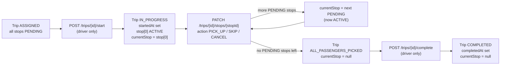

# Phase 3B — Trip Execution Workflow

Builds entirely on top of the Phase 3A architecture. Same packages, same patterns (record DTOs, `@Component` mappers, service-layer authorization via `CurrentUser`, `ApiResponse.ok(...)`, `ConflictException` / `ForbiddenException`, Riverpod + Dio on the client, `route_paths.dart` + `app_router.dart` routing).

---

## 1. Design decisions (please confirm)

These are the open choices the prompt left to me. All are easy to flip before I implement.

- **Trip statuses actively used in 3B:** `ASSIGNED → IN_PROGRESS → ALL_PASSENGERS_PICKED → COMPLETED`. I skip `STARTED` (collapses into `IN_PROGRESS`) and `HEADING_TO_DESTINATION` (no map-driven trigger yet); both stay in the enum for later phases. `INTERRUPTED` is documented as an intentional Phase 3C TODO (driver "abort trip" action).
- **Stop action API shape:** single `PATCH /api/v1/trips/{tripId}/stops/{stopId}` with body `{ "action": "PICK_UP" | "SKIP" | "CANCEL" }`. Cleaner than three sibling endpoints and matches the URI the Phase 3A stub already exposes.
- **Per-stop timestamps in absence of navigation:** when a stop is resolved we set both `actualArrivalTime` and `actualDepartureTime = now()` for `PICKED_UP` / `SKIPPED`; for `CANCELLED` we set only `actualArrivalTime = now()`. Approximate by design; an explicit `ARRIVED` action will refine this in Phase 3C.
- **Participant status side effects:** consistent, minimal mapping driven from execution.
  - stop `PICKED_UP` → participant `ASSIGNED → PICKED_UP`
  - stop `SKIPPED` → participant `ASSIGNED → NO_SHOW`
  - stop `CANCELLED` → participant `ASSIGNED → CANCELLED`
  - trip `COMPLETED` → every `PICKED_UP` passenger → `ARRIVED`, and the driver participant → `ARRIVED`
- **Service split:** keep [TripService](backend/src/main/java/com/pickup/trip/TripService.java) read-only (it already is). Add a new sibling `TripExecutionService` for the mutating lifecycle so concerns don't bleed together. Both share `TripService.loadOrThrow` / `canView`.

If you prefer (a) separate `/start-stop`, `/skip-stop`, `/cancel-stop` endpoints, (b) `STARTED` distinct from `IN_PROGRESS`, or (c) HEADING_TO_DESTINATION as the post-pickup state, say so before I write code.

---

## 2. State machine

Hard rules (all enforced in services with `ConflictException` / `ForbiddenException`):

- `start`: caller must be `trip.driver`; trip status must be `ASSIGNED`; trip must have ≥ 1 stop; sets status `IN_PROGRESS`, `startedAt`, first PENDING stop → `ACTIVE`, `currentStop` to that stop.
- `updateStop`: caller must be `trip.driver`; stop must belong to the trip; the stop must be `trip.currentStop` (the single `ACTIVE` stop); current trip status must be `IN_PROGRESS`. Allowed transitions: `ACTIVE → PICKED_UP | SKIPPED | CANCELLED`.
- After resolving, advance: if any `PENDING` stop remains, set the next one `ACTIVE` and update `currentStop`. Otherwise set trip `ALL_PASSENGERS_PICKED` and `currentStop = null`.
- `complete`: caller must be `trip.driver`; trip status must be `ALL_PASSENGERS_PICKED` at the moment of completion. If the trip is `IN_PROGRESS` but already has no `PENDING`/`ACTIVE` stops (defensive normalization for any edge case), the service first transitions it to `ALL_PASSENGERS_PICKED` and then completes; otherwise a `ConflictException` is raised. Effects: `status=COMPLETED`, `completedAt=now`, `currentStop=null`, plus the participant side effects below.

---

## 3. Files to create / modify

### Backend — create

- `backend/src/main/java/com/pickup/trip/TripExecutionService.java` — start / complete / updateStop with all rules above.
- `backend/src/main/java/com/pickup/trip/dto/UpdateTripStopRequest.java` — `record UpdateTripStopRequest(@NotNull StopAction action)` with nested `enum StopAction { PICK_UP, SKIP, CANCEL }`.

### Backend — modify

- [backend/src/main/java/com/pickup/trip/TripController.java](backend/src/main/java/com/pickup/trip/TripController.java) — replace the three `NotImplemented.phase1(...)` stubs with calls into `TripExecutionService`. All three endpoints return `ApiResponse<TripResponse>` (the freshly mutated trip) so the client always gets the new state in one round-trip.
- [backend/src/main/java/com/pickup/tripstop/TripStopRepository.java](backend/src/main/java/com/pickup/tripstop/TripStopRepository.java) — add `Optional<TripStopEntity> findFirstByTripIdAndStatusOrderBySequenceAsc(UUID tripId, StopStatus status)` to fetch the next `PENDING` stop deterministically (avoids re-iterating the in-memory list when the trip has many resolved stops).
- [backend/src/main/java/com/pickup/trip/dto/TripResponse.java](backend/src/main/java/com/pickup/trip/dto/TripResponse.java) — additive: extend `TripStopSummary` with nullable `Instant actualArrivalTime, Instant actualDepartureTime` so the UI can show "picked up at HH:MM". No removals.

### Backend — schema

**None.** All columns already exist on [TripEntity](backend/src/main/java/com/pickup/trip/TripEntity.java) (`status`, `currentStop`, `startedAt`, `completedAt`) and [TripStopEntity](backend/src/main/java/com/pickup/tripstop/TripStopEntity.java) (`status`, `actualArrivalTime`, `actualDepartureTime`).

### Frontend — create

- `frontend/lib/features/trip/data/trip_execution_dtos.dart` — `enum StopAction { pickUp, skip, cancel }` + `String stopActionToString(...)` + `UpdateTripStopRequest { final StopAction action; Map<String,dynamic> toJson(); }`. Lives next to existing `trip_dtos.dart`.
- `frontend/lib/features/trip/presentation/event_trips_screen.dart` — read-only "Event trips" monitoring screen for organizers (and participants). Reuses `eventAssignmentPlanProvider` to list trips with status / progress chips.

### Frontend — modify

- [frontend/lib/features/trip/data/trip_dtos.dart](frontend/lib/features/trip/data/trip_dtos.dart) — additive: `TripStopSummary` gains optional `actualArrivalTime` / `actualDepartureTime` (`DateTime?`) with safe `fromJson` parsing.
- [frontend/lib/features/trip/data/trip_api.dart](frontend/lib/features/trip/data/trip_api.dart) — add three methods returning `TripResponse`: `start(tripId)`, `complete(tripId)`, `updateStop(tripId, stopId, UpdateTripStopRequest)`. All three invalidate `tripDetailProvider(tripId)` + `myTripsProvider` + (in the caller) the event-scoped plan provider.
- [frontend/lib/features/trip/presentation/trip_detail_screen.dart](frontend/lib/features/trip/presentation/trip_detail_screen.dart) — split into:
  - shared `_TripBody` (header card, stop list, status chips) reused by all view modes,
  - a new "current stop" panel rendered only when `mode == driver` AND `trip.status == IN_PROGRESS`, with the three action buttons,
  - a "Start trip" button when `mode == driver` AND `trip.status == ASSIGNED`,
          - a "Complete trip" button when `mode == driver` AND `trip.status == ALL_PASSENGERS_PICKED`.
- [frontend/lib/features/driver/presentation/driver_trip_screen.dart](frontend/lib/features/driver/presentation/driver_trip_screen.dart) — unchanged structurally (still a thin wrapper around `TripDetailScreen` in driver mode).
- [frontend/lib/features/passenger/presentation/passenger_ride_screen.dart](frontend/lib/features/passenger/presentation/passenger_ride_screen.dart) — unchanged structurally. Already highlights "my stop"; will pick up the new live status / pickup-timestamp chips automatically via the shared body.
- [frontend/lib/features/event/presentation/event_detail_screen.dart](frontend/lib/features/event/presentation/event_detail_screen.dart) — add an "Event trips" outlined button inside `_OrganizerActions` (and a read-only entry for any non-organizer with view access) that pushes the new event trips screen.
- [frontend/lib/core/router/route_paths.dart](frontend/lib/core/router/route_paths.dart) + [frontend/lib/core/router/app_router.dart](frontend/lib/core/router/app_router.dart) — register `eventTrips = '/events/:id/trips'` and `eventTripsFor(eventId)`.

---

## 4. DTO changes

### Backend (new + additive)

- **New:** `UpdateTripStopRequest(@NotNull StopAction action)` with nested `enum StopAction { PICK_UP, SKIP, CANCEL }`.
- **Additive on `TripResponse.TripStopSummary`:** `Instant actualArrivalTime, Instant actualDepartureTime` (both nullable). Old clients ignore unknown fields.
- No other DTO changes. `TripResponse` already exposes `status`, `currentStopId`, `startedAt`, `completedAt`, `driverFullName`, `vehicleSummary`, and the full stop list — every field the UI needs.

### Frontend (mirror)

- **New:** `enum StopAction`, `String stopActionToString(...)`, `UpdateTripStopRequest`.
- **Additive on `TripStopSummary`:** optional `actualArrivalTime` / `actualDepartureTime`.

---

## 5. API contract summary

All under `/api/v1`. Auth: `CurrentUser.require()` (existing behavior); per-route domain checks below.

- `POST /trips/{tripId}/start` → `ApiResponse<TripResponse>`. Auth: caller must equal `trip.driver`. Pre-cond: `trip.status == ASSIGNED` and `trip.stops` non-empty. Side effects: `status=IN_PROGRESS`, `startedAt=now`, first PENDING stop → `ACTIVE`, `currentStop` set.
- `PATCH /trips/{tripId}/stops/{stopId}` → `ApiResponse<TripResponse>`. Body `UpdateTripStopRequest`. Auth: caller must equal `trip.driver`. Pre-cond: stop belongs to trip, stop is the trip's current `ACTIVE` stop, trip is `IN_PROGRESS`. Effects: stop status set per action; timestamps populated as in §1; passenger participant status mapped as in §1; next PENDING stop activated (or trip → `ALL_PASSENGERS_PICKED`, `currentStop=null`).
- `POST /trips/{tripId}/complete` → `ApiResponse<TripResponse>`. Auth: caller must equal `trip.driver`. Pre-cond: `trip.status == ALL_PASSENGERS_PICKED` (with defensive auto-normalization from `IN_PROGRESS` only when no `PENDING`/`ACTIVE` stops remain). Effects: `status=COMPLETED`, `completedAt=now`, `currentStop=null`, all `PICKED_UP` passengers → `ARRIVED`, driver participant → `ARRIVED`.
- Existing read endpoints unchanged: `GET /trips/{tripId}`, `GET /events/{eventId}/trips`, `GET /users/me/trips`. They return the enriched `TripResponse` (now with per-stop timestamps).

Error contract: rule violations raise `ConflictException` (409 via `GlobalExceptionHandler`); permission violations raise `ForbiddenException` (403). All wrapped by the existing `ApiResponse` envelope and parsed by the existing `ApiException.fromDio` on the client.

---

## 6. Entity / schema changes

**None.** All required columns already exist:

- [TripEntity.status / currentStop / startedAt / completedAt](backend/src/main/java/com/pickup/trip/TripEntity.java) — present since Phase 1.
- [TripStopEntity.status / actualArrivalTime / actualDepartureTime](backend/src/main/java/com/pickup/tripstop/TripStopEntity.java) — present since Phase 1.
- [ParticipantStatus](backend/src/main/java/com/pickup/common/enums/ParticipantStatus.java) already includes `PICKED_UP`, `ARRIVED`, `NO_SHOW`, `CANCELLED`.

---

## 7. UI sketch

```mermaid
flowchart TB
    subgraph driver [Driver trip screen]
        Header["Header card<br/>(event, driver, vehicle, trip status chip)"]
        Active["Current stop panel<br/>(name, address, ETA placeholder)"]
        Actions["Buttons:<br/>Picked up · Skip · Cancel"]
        List["Full stop list with status chips"]
        Footer["Bottom: Start trip / Complete trip<br/>(based on trip status)"]
        Header --> Active --> Actions --> List --> Footer
    end
    subgraph passenger [Passenger ride screen]
        PHead["Header (driver, vehicle, status)"]
        Mine["Your stop tile (highlighted, with status + pickup time if set)"]
        Plist["Rest of stops (read-only)"]
        PHead --> Mine --> Plist
    end
    subgraph monitor [Organizer trip monitor]
        TList["One card per trip:<br/>status chip<br/>current stop label<br/>X / Y stops resolved"]
    end
```

---

## 8. Intentional TODOs left for Phase 3C

- `POST /trips/{id}/interrupt` (driver abort → `TripStatus.INTERRUPTED`).
- Stop `NAVIGATING` / `ARRIVED` intermediate states (requires Google Maps deep links / GPS).
- Auto-transition to `HEADING_TO_DESTINATION` (requires explicit "start navigation to destination" action).
- Auto-assignment endpoint `POST /events/{id}/planning/generate-assignments` (still a stub).
- WebSocket / FCM live trip updates (organizer monitor is a pull-to-refresh page in 3B).
- Reorder / re-route stops mid-trip.
- Driver self-undo of a wrong PICK_UP / SKIP / CANCEL within a grace window.
