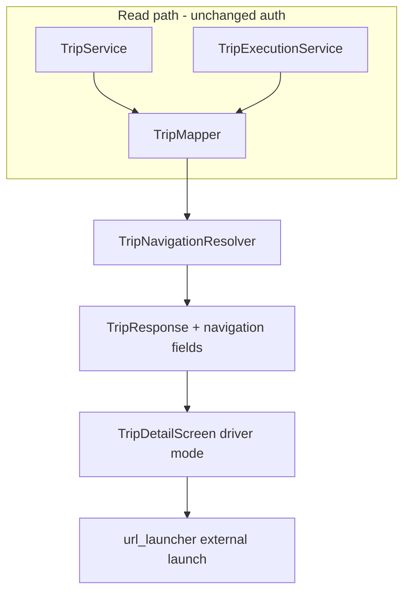

# Phase 3C — Step-by-Step External Navigation

## Architecture overview

Phase 3B already provides the execution cursor via `Trip.currentStop` and final-destination snapshots on `TripEntity`. Phase 3C adds a **pure read-side computation layer** that derives navigation targets from trip status + existing coordinates, exposes them on `TripResponse`, and lets the driver launch Google Maps externally.



**Design decisions (aligned with your constraints):**

- **No separate `/navigation` endpoint** — all trip reads already flow through [`TripMapper`](backend/src/main/java/com/pickup/trip/TripMapper.java); enriching `TripResponse` keeps the API simple and avoids duplicate auth.
- **No DB writes for navigation** — do not populate `TripStopEntity.navigationLink` or `TripEntity.encodedPolyline`; those remain Phase 4 placeholders.
- **No new execution states** — keep Phase 3B status machine (`ASSIGNED → IN_PROGRESS → ALL_PASSENGERS_PICKED → COMPLETED`); do not introduce `NAVIGATING` / `HEADING_TO_DESTINATION` transitions.
- **Computed-only DTO fields** — `navigationTargetType`, `navigationLabel`, `navigationUrl` are derived at map time.

---

## 1. Backend implementation

### 1.1 Navigation target resolution

Create [`backend/src/main/java/com/pickup/trip/navigation/TripNavigationResolver.java`](backend/src/main/java/com/pickup/trip/navigation/TripNavigationResolver.java):

Pure `@Component` with a single method, e.g. `NavigationInfo resolve(TripEntity trip)`.

| Trip status | Condition | `navigationTargetType` | URL source | Label source |
|---|---|---|---|---|
| `ASSIGNED` | — | `NONE` | `null` | `null` |
| `IN_PROGRESS` | `currentStop != null` | `CURRENT_STOP` | stop `lat,lng` | e.g. `"Pickup: {userFullName}"` + address |
| `IN_PROGRESS` | `currentStop == null` | `NONE` | `null` | `null` (defensive; should not occur in normal flow) |
| `ALL_PASSENGERS_PICKED` | — | `FINAL_DESTINATION` | `finalDestinationLat/Lng` | `finalDestinationAddress` |
| `COMPLETED` | — | `NONE` | `null` | `null` |
| Other (`STARTED`, `INTERRUPTED`, etc.) | — | `NONE` | `null` | `null` |

Create [`backend/src/main/java/com/pickup/common/enums/NavigationTargetType.java`](backend/src/main/java/com/pickup/common/enums/NavigationTargetType.java):

```java
public enum NavigationTargetType { NONE, CURRENT_STOP, FINAL_DESTINATION }
```

Create [`backend/src/main/java/com/pickup/trip/navigation/GoogleMapsNavigationUrlBuilder.java`](backend/src/main/java/com/pickup/trip/navigation/GoogleMapsNavigationUrlBuilder.java):

- Build coordinate-first HTTPS URLs (cross-platform, opens Google Maps app on mobile):
  - `https://www.google.com/maps/dir/?api=1&destination={lat},{lng}&travelmode=driving`
- Validate lat/lng are finite/non-zero before building; return `null` if invalid.
- Keep URL encoding minimal (coordinates only; human-readable text stays in `navigationLabel`).

Nested record on resolver (or separate small class):

```java
public record NavigationInfo(
    NavigationTargetType targetType,
    String label,
    String url
) {}
```

### 1.2 DTO enrichment

Extend [`backend/src/main/java/com/pickup/trip/dto/TripResponse.java`](backend/src/main/java/com/pickup/trip/dto/TripResponse.java) **additively** (append after existing fields):

```java
NavigationTargetType navigationTargetType,
String navigationLabel,
String navigationUrl
```

Wire in [`TripMapper.toResponse()`](backend/src/main/java/com/pickup/trip/TripMapper.java):

```java
NavigationInfo nav = navigationResolver.resolve(entity);
// pass nav.targetType(), nav.label(), nav.url() into TripResponse
```

All existing read paths automatically pick up navigation fields:

- `GET /trips/{id}` via [`TripService.getTrip()`](backend/src/main/java/com/pickup/trip/TripService.java)
- `GET /events/{eventId}/trips` via assignment plan
- `GET /users/me/trips`
- Mutation responses from [`TripExecutionService`](backend/src/main/java/com/pickup/trip/TripExecutionService.java) (`start`, `updateStop`, `complete`)

### 1.3 Minor Phase 3B refinements (minimal)

- Update the Phase 3C comment block in `TripExecutionService` to clarify navigation is read-computed, not a new status transition.
- No changes to stop/trip status enums or execution logic unless a bug is found during integration.

### 1.4 Optional endpoint

**Skip** `GET /trips/{id}/navigation` — DTO enrichment is sufficient and keeps one source of truth.

---

## 2. Frontend implementation

### 2.1 Dependency

Add to [`frontend/pubspec.yaml`](frontend/pubspec.yaml):

```yaml
url_launcher: ^6.3.1
```

Run `flutter pub get` after adding.

### 2.2 DTO changes

Extend [`frontend/lib/features/trip/data/trip_dtos.dart`](frontend/lib/features/trip/data/trip_dtos.dart):

```dart
enum NavigationTargetType { none, currentStop, finalDestination, unknown }

NavigationTargetType navigationTargetTypeFromString(String? raw);
String navigationTargetLabel(NavigationTargetType t);
```

Add to `TripResponse`:

- `NavigationTargetType navigationTargetType`
- `String navigationTargetTypeRaw`
- `String? navigationLabel`
- `String? navigationUrl`

Parse missing keys as `none` / `null` for backward compatibility.

### 2.3 URL launch utility

Create [`frontend/lib/core/launch/external_url_launcher.dart`](frontend/lib/core/launch/external_url_launcher.dart):

```dart
Future<void> launchExternalUrl(BuildContext context, String url) async {
  final uri = Uri.parse(url);
  if (!await canLaunchUrl(uri)) { /* SnackBar */ return; }
  await launchUrl(uri, mode: LaunchMode.externalApplication);
}
```

Centralizes error SnackBars ("Could not open navigation") per your UX requirement.

### 2.4 Driver trip screen — navigation UI

Modify [`frontend/lib/features/trip/presentation/trip_detail_screen.dart`](frontend/lib/features/trip/presentation/trip_detail_screen.dart):

**New widget: `_NavigationTargetCard`** (driver mode only):

| State | Visible | Button label | Context text |
|---|---|---|---|
| `assigned` | No | — | — |
| `inProgress` + `CURRENT_STOP` | Yes | **Start Navigation** | pickup stop name + address |
| `allPassengersPicked` + `FINAL_DESTINATION` | Yes | **Navigate to Destination** | final destination address |
| `completed` | No | — | — |

**Layout order in `_TripBody` (driver):**

1. `_HeaderCard`
2. `_StartTripCard` (if `assigned`)
3. **`_NavigationTargetCard`** (if `navigationUrl != null`) — navigation launch, separate from execution
4. `_CurrentStopCard` (if `inProgress`) — pick up / skip / cancel only
5. `_CompleteTripCard` (if `allPassengersPicked`)
6. Stop list

Remove the Phase 3B placeholder footer text (lines 194–200).

**Button behavior:** tap → `launchExternalUrl(context, trip.navigationUrl!)`; disabled while `_busy` is true.

### 2.5 Passenger and organizer lightweight display

Same file + [`frontend/lib/features/trip/presentation/event_trips_screen.dart`](frontend/lib/features/trip/presentation/event_trips_screen.dart):

- **Passenger** [`_PassengerRideStatusCard`](frontend/lib/features/trip/presentation/trip_detail_screen.dart): when `navigationTargetType == finalDestination`, subtitle already says "heading to destination"; optionally append `navigationLabel` if present.
- **Monitor mode**: add a read-only `_NavigationContextBanner` (icon + `navigationTargetLabel` + address) when `navigationUrl != null`; no launch button.
- **Event trips list** [`_currentStopLabel()`](frontend/lib/features/trip/presentation/event_trips_screen.dart): prefer `trip.navigationLabel` when `navigationTargetType != none` for clearer organizer context.

No navigation buttons in passenger or monitor modes.

### 2.6 Platform configuration

[`frontend/android/app/src/main/AndroidManifest.xml`](frontend/android/app/src/main/AndroidManifest.xml) — extend existing `<queries>` block (required for `canLaunchUrl` on Android 11+):

```xml
<intent>
  <action android:name="android.intent.action.VIEW" />
  <data android:scheme="https" />
</intent>
```

iOS: HTTPS launch via `url_launcher` works without `LSApplicationQueriesSchemes` changes.

---

## 3. DTO changes summary

### Backend `TripResponse` (additive)

| Field | Type | When set |
|---|---|---|
| `navigationTargetType` | `NavigationTargetType` | Always (default `NONE`) |
| `navigationLabel` | `String?` | `CURRENT_STOP` or `FINAL_DESTINATION` |
| `navigationUrl` | `String?` | When a valid coordinate target exists |

All existing fields unchanged.

### Frontend `TripResponse` mirror

Same three fields + `NavigationTargetType` enum + label helper.

---

## 4. API contract summary

No new endpoints. Existing responses gain three optional fields.

**Example — trip in progress at stop 2:**

```json
{
  "id": "...",
  "status": "IN_PROGRESS",
  "currentStopId": "...",
  "navigationTargetType": "CURRENT_STOP",
  "navigationLabel": "Pickup: Jane Doe — 123 Main St",
  "navigationUrl": "https://www.google.com/maps/dir/?api=1&destination=40.7128,-74.0060&travelmode=driving",
  "stops": [ ... ]
}
```

**Example — all passengers picked:**

```json
{
  "status": "ALL_PASSENGERS_PICKED",
  "currentStopId": null,
  "navigationTargetType": "FINAL_DESTINATION",
  "navigationLabel": "Central Park, NYC",
  "navigationUrl": "https://www.google.com/maps/dir/?api=1&destination=40.7829,-73.9654&travelmode=driving"
}
```

**Example — assigned (not started):**

```json
{
  "status": "ASSIGNED",
  "navigationTargetType": "NONE",
  "navigationLabel": null,
  "navigationUrl": null
}
```

Auth unchanged: organizer, driver, or stop passenger may read; only driver sees launch controls in UI.

---

## 5. Schema / entity changes

**None required.**

Existing columns used read-only:

- `trips.current_stop_id`
- `trips.final_destination_address / lat / lng`
- `trip_stops.lat / lng / address`

Entity placeholders `navigationLink` and `encodedPolyline` remain unused until Phase 4.

---

## 6. New frontend dependency

| Package | Purpose |
|---|---|
| [`url_launcher`](https://pub.dev/packages/url_launcher) `^6.3.1` | Open Google Maps HTTPS deep links externally |

No map SDK, geolocation, or routing packages.

---

## 7. Files to create / modify

### Backend — create

- [`backend/src/main/java/com/pickup/common/enums/NavigationTargetType.java`](backend/src/main/java/com/pickup/common/enums/NavigationTargetType.java)
- [`backend/src/main/java/com/pickup/trip/navigation/GoogleMapsNavigationUrlBuilder.java`](backend/src/main/java/com/pickup/trip/navigation/GoogleMapsNavigationUrlBuilder.java)
- [`backend/src/main/java/com/pickup/trip/navigation/TripNavigationResolver.java`](backend/src/main/java/com/pickup/trip/navigation/TripNavigationResolver.java)

### Backend — modify

- [`backend/src/main/java/com/pickup/trip/dto/TripResponse.java`](backend/src/main/java/com/pickup/trip/dto/TripResponse.java)
- [`backend/src/main/java/com/pickup/trip/TripMapper.java`](backend/src/main/java/com/pickup/trip/TripMapper.java)
- [`backend/src/main/java/com/pickup/trip/TripExecutionService.java`](backend/src/main/java/com/pickup/trip/TripExecutionService.java) — comment-only refinement

### Frontend — create

- [`frontend/lib/core/launch/external_url_launcher.dart`](frontend/lib/core/launch/external_url_launcher.dart)

### Frontend — modify

- [`frontend/pubspec.yaml`](frontend/pubspec.yaml)
- [`frontend/lib/features/trip/data/trip_dtos.dart`](frontend/lib/features/trip/data/trip_dtos.dart)
- [`frontend/lib/features/trip/presentation/trip_detail_screen.dart`](frontend/lib/features/trip/presentation/trip_detail_screen.dart)
- [`frontend/lib/features/trip/presentation/event_trips_screen.dart`](frontend/lib/features/trip/presentation/event_trips_screen.dart)
- [`frontend/android/app/src/main/AndroidManifest.xml`](frontend/android/app/src/main/AndroidManifest.xml)

---

## 8. Verification

1. **Backend:** `mvn -f backend compile`
2. **Frontend:** `flutter pub get && flutter analyze`
3. **Manual smoke test:**
   - Create assignment → driver starts trip → **Start Navigation** opens Maps to first stop
   - Resolve stop → navigation URL updates to next stop
   - Resolve all stops → **Navigate to Destination** opens final destination
   - Complete trip → navigation card disappears
   - Passenger/monitor views show context text, no launch button

---

## 9. Intentional TODOs for Phase 4

- Populate `TripStopEntity.navigationLink` / persist precomputed links (if ever needed for offline)
- Google Routes API → `encodedPolyline`, `etaMinutes`
- Live GPS tracking + WebSocket/FCM push to passengers/organizers
- Explicit `NAVIGATING` / `ARRIVED` stop actions and GPS-driven timestamps
- Route optimization, auto-assignment, meeting-point recommendation
- Driver abort / `INTERRUPTED` trip handling
