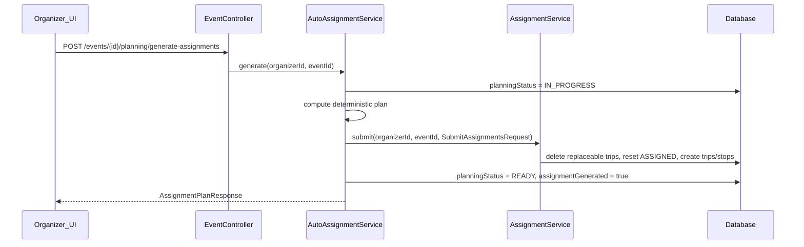

# Phase 4A — Automatic Driver-Passenger Assignment

Builds directly on [AssignmentService.java](backend/src/main/java/com/pickup/event/assignment/AssignmentService.java) (full-replace trips), [EventEntity planning fields](backend/src/main/java/com/pickup/event/EventEntity.java) (currently read-only), and the existing Flutter assignment module. No schema changes, no route optimization, no new dependencies.

---

## 1. Architecture



**Core principle:** auto-assignment is a **planner** that produces a `SubmitAssignmentsRequest`; all trip creation, participant status transitions, preserved-trip handling, and `unassignedConfirmedPassengerIds` computation stay in the existing assignment layer.

---

## 2. Backend design

### 2.1 New `AutoAssignmentService`

**File:** `backend/src/main/java/com/pickup/event/planning/AutoAssignmentService.java`

**Method:** `@Transactional AssignmentPlanResponse generate(UUID organizerId, UUID eventId)`

**Flow:**

1. Load event; `eventService.requireOrganizer(event, organizerId)`.
2. Set `event.planningStatus = IN_PROGRESS`; persist via `EventRepository`.
3. Load participants (`findAllByEventIdOrderByCreatedAtAsc`) and existing trips.
4. Compute **locked participant IDs** from preserved trips via shared `AssignmentPreservation` helper (see §2.5). Locked drivers and locked passengers are excluded from the auto-assignment pool; only replaceable (`ASSIGNED`-status) trips are rebuilt by `submit()`.
5. Build eligible pools:

| Pool | Rules |
|------|-------|
| **Drivers** | `role == DRIVER`; status `CONFIRMED` or `ASSIGNED` (same assignable set as manual); `vehicle != null`; **not** a locked driver on a preserved trip |
| **Passengers** | `role == PASSENGER`; status `CONFIRMED` or `ASSIGNED`; full pickup geo; **not** a locked passenger on a preserved trip stop |

   Exclude `ORGANIZER` and `INDEPENDENT_ATTENDEE` implicitly via role filter.

6. **Deterministic assignment algorithm** (no randomness):
   - Sort eligible drivers by **`EventParticipant.createdAt` asc, then `EventParticipant.id` asc** — participant-row ordering, not `User` ordering.
   - Sort eligible passengers by **`EventParticipant.createdAt` asc, then `EventParticipant.id` asc** — same rule.
   - For each driver in order, assign passengers sequentially until `vehicle.seats - 1` capacity is reached; each passenger at most once globally.
   - Emit `DriverAssignment` rows **only for drivers with ≥ 1 passenger** (avoids empty ASSIGNED trips).
7. Build `SubmitAssignmentsRequest` and delegate to `assignmentService.submit(...)`.
8. On success: `planningStatus = READY`, `assignmentGenerated = true`; save event; return response.
9. On any exception: set `planningStatus = FAILED` via `EventPlanningStatusWriter` (`REQUIRES_NEW` so FAILED survives rollback of the main transaction), rethrow. **Partial capacity shortage is not an exception** — unassigned passengers stay `CONFIRMED` via normal submit side-effects.

**Passenger ordering within a driver:** preserve the global sorted passenger order (first-fit). Stop sequence = assignment order (same as manual submit: `sequence = index`). Pickup-order optimization is explicitly out of scope.

### 2.2 Reuse vs refactor `AssignmentService`

**Preferred approach (minimal diff):** `AutoAssignmentService` calls existing `submit()` — zero duplicated trip/stop creation logic, preserved-trip behavior stays identical.

**Required refactor for clarity:** extract a shared `AssignmentPreservation` helper used by both `AssignmentService` and `AutoAssignmentService`:

- `PRESERVED_TRIP_STATUSES` — single source of truth for in-flight/completed trips
- `isPreserved(TripEntity)` — replace inline status checks in `AssignmentService`
- `lockedDriverParticipantIds(eventId, trips, participantRepository)` — driver participant IDs on preserved trips
- `lockedPassengerParticipantIds(trips)` — passenger participant IDs on stops of preserved trips

`AssignmentService.submit()` continues to skip locked drivers on re-submit and delete only non-preserved trips. `AutoAssignmentService` uses the same helpers to **exclude** locked drivers/passengers from the assignment pool before computing the plan.

Do **not** extract a second trip-builder path; one `submit()` entry point prevents drift.

Manual `POST /assignments` continues unchanged and does **not** touch `planningStatus` / `assignmentGenerated`.

### 2.5 Preserved-trip behavior (explicit)

Preserved trips (`STARTED`, `IN_PROGRESS`, `ALL_PASSENGERS_PICKED`, `COMPLETED`, etc.) must never be rebuilt by auto-assignment. The code must make this explicit:

| Who | Rule |
|-----|------|
| **Locked drivers** | Driver participant on a preserved trip → excluded from auto-assignment driver pool; skipped on manual re-submit |
| **Locked passengers** | Passenger on any stop of a preserved trip → excluded from auto-assignment passenger pool |
| **Replaceable trips** | Trips with `TripStatus.ASSIGNED` only → deleted and rebuilt by `submit()`; their drivers/passengers reset to `CONFIRMED` first |

Auto-assignment never assigns passengers to locked drivers or reassigns locked passengers. Overflow / capacity shortage among **eligible** passengers is normal and not a failure.

### 2.3 Planning status integration

Use existing enum [EventPlanningStatus.java](backend/src/main/java/com/pickup/common/enums/EventPlanningStatus.java):

| Transition | When |
|------------|------|
| `* → IN_PROGRESS` | Auto-generate starts |
| `IN_PROGRESS → READY` | Submit succeeds (even if some passengers unassigned) |
| `IN_PROGRESS → FAILED` | Uncaught domain/validation error |
| `assignmentGenerated = true` | Only on successful READY |

Retry after FAILED: next auto-run sets `IN_PROGRESS` again.

**No new GET `/planning/status` endpoint.** [EventResponse](backend/src/main/java/com/pickup/event/dto/EventResponse.java) and [EventDashboardResponse](backend/src/main/java/com/pickup/event/dto/EventDashboardResponse.java) already expose `planningStatus`; dashboard can optionally add `assignmentGenerated` later — not required for 4A UI.

### 2.4 Controller wiring

Replace stub in [EventController.java](backend/src/main/java/com/pickup/event/EventController.java):

```java
@PostMapping("/{id}/planning/generate-assignments")
public ApiResponse<AssignmentPlanResponse> generateAssignments(@PathVariable UUID id) {
    return ApiResponse.ok(autoAssignmentService.generate(CurrentUser.require().getId(), id));
}
```

Inject `AutoAssignmentService`; remove `NotImplemented` import for this method.

**Organizer-only auth:** enforced inside service via `requireOrganizer` (same as manual submit).

---

## 3. DTO changes

**No breaking changes.** Reuse existing records:

- **Request:** none (POST has no body)
- **Response:** [AssignmentPlanResponse](backend/src/main/java/com/pickup/event/assignment/dto/AssignmentPlanResponse.java) — `eventId`, `trips`, `unassignedConfirmedPassengerIds`

**Optional additive extension** (only if we want richer SnackBar text without client-side counting):

```java
public record AssignmentPlanResponse(
    UUID eventId,
    List<TripResponse> trips,
    List<UUID> unassignedConfirmedPassengerIds,
    int tripsCreated,          // optional
    int passengersAssigned     // optional
) {}
```

**Recommendation:** keep DTO unchanged for 4A; client derives counts from `trips` + `unassignedConfirmedPassengerIds`. Mirror unchanged on Flutter [assignment_dtos.dart](frontend/lib/features/assignment/data/assignment_dtos.dart).

---

## 4. API contract summary

| Method | Path | Auth | Body | Response |
|--------|------|------|------|----------|
| `POST` | `/api/v1/events/{eventId}/planning/generate-assignments` | JWT + organizer | none | `ApiResponse<AssignmentPlanResponse>` |

**Success (200):** replaces non-preserved trips; returns full plan view identical to `GET /events/{eventId}/trips`.

**Side effects:**
- Replaceable trips deleted; prior `ASSIGNED` drivers/passengers on those trips → `CONFIRMED`
- New trips: `TripStatus.ASSIGNED`, stops `StopStatus.PENDING`, no auto-start
- Assigned drivers/passengers → `ASSIGNED`
- Overflow passengers remain `CONFIRMED`; listed in `unassignedConfirmedPassengerIds`
- Event: `planningStatus=READY`, `assignmentGenerated=true`

**Errors:**
- `403` — not organizer
- `404` — event not found
- `409` — submit validation failure (e.g. inconsistent state); `planningStatus=FAILED`
- Preserved in-flight trips untouched (same as manual re-submit)

**Unchanged endpoints:** `POST /events/{id}/assignments`, `GET /events/{id}/trips`, all trip execution/navigation endpoints.

---

## 5. Schema / entity changes

**None.** All columns exist on `EventEntity` (`planning_status`, `assignment_generated`), `TripEntity`, `TripStopEntity`, `EventParticipantEntity`.

---

## 6. Frontend design

### 6.1 API layer

Extend [assignment_api.dart](frontend/lib/features/assignment/data/assignment_api.dart):

```dart
Future<AssignmentPlanResponse> generateAssignments(String eventId) =>
  _call(() => _dio.post('/events/$eventId/planning/generate-assignments'));
```

Reuse existing `_call` + envelope parsing.

### 6.2 Event detail — primary entry

In [_OrganizerActions](frontend/lib/features/event/presentation/event_detail_screen.dart) (same `canManageAssignments` gate as "Manage assignments"):

- Add **Auto Assign** `FilledButton` or `OutlinedButton` beside existing buttons
- `_working` guard + loading indicator (same `_act` pattern)
- On success: invalidate `eventAssignmentPlanProvider`, `eventParticipantsProvider`, `eventDashboardProvider`, `eventDetailProvider`, `myTripsProvider`
- SnackBar summary: `"Created N trips · M passengers assigned · K unassigned"` (derived from response)

Disable button while `planningStatus == 'IN_PROGRESS'` if event detail is loaded (edge case for double-tap).

### 6.3 Assignment screen — in-context entry

In [manage_assignments_screen.dart](frontend/lib/features/assignment/presentation/manage_assignments_screen.dart):

- Add header action row: **Auto Assign** (runs API) + keep existing per-driver manual editing
- Rename bottom button label to **Save manual plan** (optional clarity) or keep **Save plan**
- `_autoAssigning` busy flag (parallel to `_saving`)
- On success: same invalidation as `_save()`, `_applyDraftFromPlan(...)`, SnackBar with summary
- **Unassigned passengers:** existing bottom section already renders unassigned from draft; after auto-run, draft syncs from server plan — also cross-check `plan.unassignedConfirmedPassengerIds` for consistency

### 6.4 UX notes

- No confirmation dialog required for 4A (organizer can re-run or manual-edit)
- Do not navigate away after auto-assign; stay on screen so organizer sees grouping immediately
- Trip execution / navigation screens unchanged

---

## 7. Files to create or modify

### Backend — create

| File | Purpose |
|------|---------|
| `backend/src/main/java/com/pickup/event/assignment/AssignmentPreservation.java` | Shared preserved-trip constants + locked driver/passenger ID helpers |
| `backend/src/main/java/com/pickup/event/planning/AutoAssignmentService.java` | EventParticipant-ordered algorithm + planning lifecycle + delegate to submit |
| `backend/src/main/java/com/pickup/event/planning/EventPlanningStatusWriter.java` | `markFailed()` in `REQUIRES_NEW` transaction |

### Backend — modify

| File | Change |
|------|--------|
| [EventController.java](backend/src/main/java/com/pickup/event/EventController.java) | Wire real endpoint; return `AssignmentPlanResponse` |
| [AssignmentService.java](backend/src/main/java/com/pickup/event/assignment/AssignmentService.java) | Use `AssignmentPreservation` instead of inline preserved-trip logic |

### Frontend — modify

| File | Change |
|------|--------|
| [assignment_api.dart](frontend/lib/features/assignment/data/assignment_api.dart) | Add `generateAssignments` |
| [event_detail_screen.dart](frontend/lib/features/event/presentation/event_detail_screen.dart) | Auto Assign button in `_OrganizerActions` |
| [manage_assignments_screen.dart](frontend/lib/features/assignment/presentation/manage_assignments_screen.dart) | Auto Assign button + summary SnackBar |

### Frontend — no new files required

---

## 8. Verification

1. **Backend:** `mvn -f backend compile`
2. **Frontend:** `flutter analyze`
3. **Smoke scenarios** (dev seed or manual):
   - 2 drivers (4+4 seats), 5 confirmed passengers → 5 assigned, 0 unassigned, 2 trips
   - 1 driver (4 seats), 6 passengers → 3 assigned, 3 unassigned (not FAILED)
   - Driver without vehicle → excluded; passengers assigned to other drivers
   - Passenger without pickup → stays unassigned
   - Re-run auto after manual edit → replaceable trips rebuilt deterministically
   - Start trip (3B) + re-run auto → locked driver and their passengers preserved; other replaceable trips reassigned
   - Passenger on in-flight trip → excluded from auto pool; remains on preserved trip
   - Manual save after auto → still works; planning fields unchanged by manual save

---

## 9. Intentional TODOs for Phase 4B+

- Pickup **stop order** optimization within each trip
- Distance / detour / fairness heuristics for pairing
- Google Routes API / ETA / meeting points
- `GET /planning/status` or async job polling if generation becomes slow
- Unit tests for assignment algorithm (no test harness exists today)
- Dashboard `assignmentGenerated` field exposure
- Confirmation dialog before overwriting an existing manual plan
- Exclude passengers without pickup from eligible pool with explicit "skipped" reason in response
