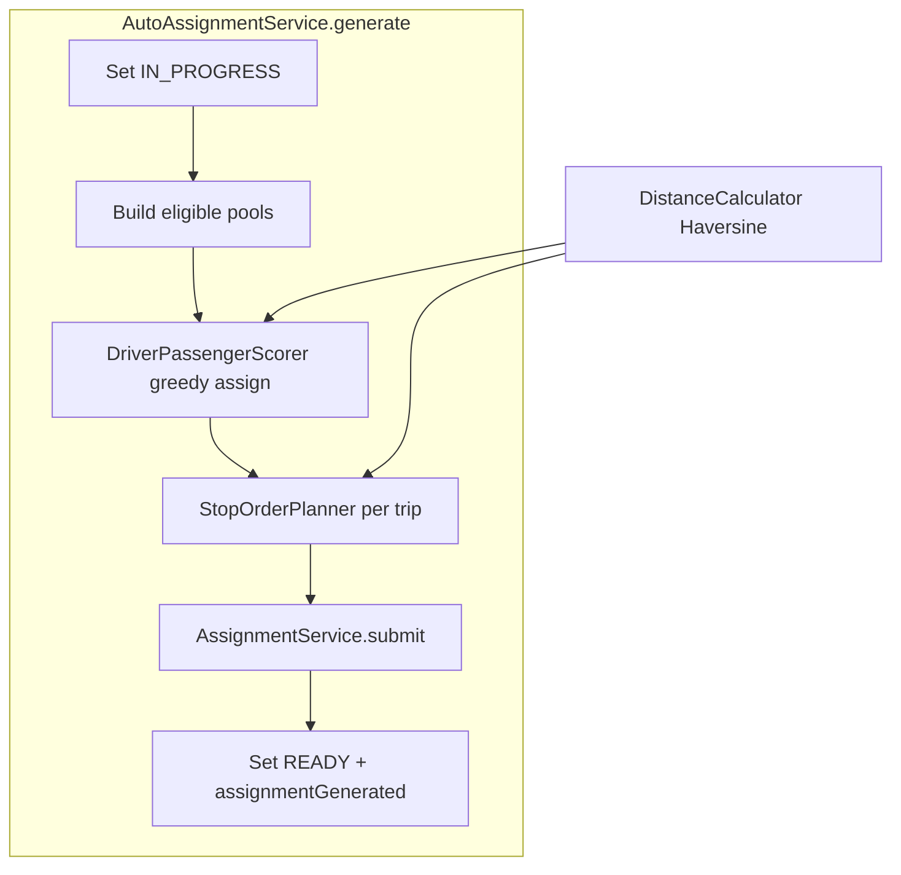

# Phase 4B — Routing-Aware Assignment Planning

Builds directly on [AutoAssignmentService.java](backend/src/main/java/com/pickup/event/planning/AutoAssignmentService.java) (planner → `AssignmentService.submit`) and the existing trip execution model. **No schema changes, no new API endpoints, no Google Routes API.**

---

## 1. Heuristic strategy

### 1.0 Domain convention — driver trip start location

For **DRIVER** participants in this phase, interpret `EventParticipantEntity.pickupLat` / `pickupLng` (and `pickupAddress` when present) as the driver’s **trip start location** — where the driver begins the pickup route before the first passenger stop.

- Use this meaning consistently in scorer distance, stop-order anchor selection, code comments, and unit tests.
- Do **not** overload the field with a different semantic for drivers elsewhere in 4B.
- Passengers continue to use the same columns as their **pickup location** (unchanged).
- If a driver has no complete trip-start coords, scoring and stop ordering fall back as described below (no new schema or API fields).

### 1.1 Driver–passenger grouping (replaces first-fit)

**Algorithm:** deterministic greedy assignment.

1. Sort eligible passengers by `createdAt ASC`, then `id ASC` (unchanged).
2. Track `remainingCapacity` per driver (`vehicle.seats - 1`, minus already assigned).
3. For each passenger in order:
  - Consider drivers with `remainingCapacity > 0`.
  - Rank drivers by **lexicographic score** (lower wins):
  1. **Primary — proximity:** Haversine distance from driver **trip start** to passenger pickup (meters). Trip start = driver `pickupLat/Lng` when complete; if missing, use `Double.MAX_VALUE` so all drivers without coords tie on this key.
  2. **Secondary — capacity:** `-remainingCapacity` (when distances tie, prefer drivers with more remaining seats to **reduce early capacity exhaustion** — i.e. avoid filling a driver to capacity while other eligible drivers still have room, which would block later passengers who might fit better elsewhere).
  3. **Weak tie-breaker — destination alignment:** `|dist(driver trip start, dest) − dist(passenger pickup, dest)|` (prefer drivers whose position relative to the event is similar to the passenger’s).
  4. **Deterministic fallback:** driver `createdAt ASC`, then `id ASC`.
  - Assign passenger to best driver; decrement capacity.
4. Emit `DriverAssignment` **only for drivers with ≥ 1 passenger** (same as 4A).

**Properties preserved:** seat limits, one passenger per trip globally, locked drivers/passengers excluded, preserved trips untouched, overflow passengers unassigned (not FAILED).

**Manual assignment unchanged:** organizer-submitted passenger list order still maps 1:1 to `TripStop.sequence` in [AssignmentService.submit](backend/src/main/java/com/pickup/event/assignment/AssignmentService.java) (lines 199–210).

### 1.2 Intra-trip stop ordering (auto-generated trips only)

After grouping, reorder each driver’s passenger ID list **before** building `SubmitAssignmentsRequest`. `AssignmentService` continues `sequence = index`.

**Algorithm:** nearest-neighbor (deterministic).

| Condition                              | Start anchor         | Method                                                                                                                                                                               |
| -------------------------------------- | -------------------- | ------------------------------------------------------------------------------------------------------------------------------------------------------------------------------------ |
| Driver has complete trip-start coords  | Driver trip start    | Classic NN: start at driver trip start, repeatedly visit nearest unvisited passenger pickup                                                                                          |
| No driver trip start, ≥ 2 stops        | Event destination    | **Reverse NN:** `current = destination`; repeatedly pick nearest unvisited stop to `current`, **prepend** to order, set `current = stop`; yields pickups from far → near destination |
| Single stop or no usable coords        | —                    | Preserve assignment order                                                                                                                                                            |

Ties on distance: break by passenger `createdAt`, then `id`.

**Trip execution impact:** none. [TripExecutionService](backend/src/main/java/com/pickup/trip/TripExecutionService.java) already advances by `sequence ASC`; navigation targets first/current stop unchanged.

### 1.3 Meeting point

**Recommendation: leave `meetingPointName` null.** Stops already store the passenger pickup address/coords; a placeholder like `"Pickup location"` adds noise without real recommendation logic. Field remains available for Phase 4C+.

---

## 2. Backend components

### 2.1 `DistanceCalculator` (new)

**File:** [backend/src/main/java/com/pickup/common/geo/DistanceCalculator.java](backend/src/main/java/com/pickup/common/geo/DistanceCalculator.java)

- `static final double EARTH_RADIUS_METERS`
- `static double distanceMeters(double lat1, double lng1, double lat2, double lng2)` — Haversine, WGS-84
- Package under `common.geo` for reuse by future ETA/routing work
- Pure static methods; no Spring bean required

### 2.2 `GeoPoint` helper (new, optional small record)

**File:** [backend/src/main/java/com/pickup/common/geo/GeoPoint.java](backend/src/main/java/com/pickup/common/geo/GeoPoint.java)

- `record GeoPoint(double lat, double lng)`
- Role-aware factories (names encode the domain convention):
  - `static Optional<GeoPoint> tripStartFromDriver(EventParticipantEntity driver)` — driver `pickupLat/Lng` as trip start
  - `static Optional<GeoPoint> pickupFromPassenger(EventParticipantEntity passenger)` — passenger pickup coords
- Avoids duplicating null-check logic in scorer/planner; comments reference “trip start” vs “pickup” explicitly

### 2.3 `DriverPassengerScorer` (new)

**File:** [backend/src/main/java/com/pickup/event/planning/DriverPassengerScorer.java](backend/src/main/java/com/pickup/event/planning/DriverPassengerScorer.java)

- `static List<DriverAssignment> assign(List<EventParticipantEntity> drivers, List<EventParticipantEntity> passengers, GeoPoint destination)`
- Encapsulates greedy loop + lexicographic comparison
- Replace `AutoAssignmentService.computeAssignments` body; keep package-private static entry for unit tests

### 2.4 `StopOrderPlanner` (new)

**File:** [backend/src/main/java/com/pickup/event/planning/StopOrderPlanner.java](backend/src/main/java/com/pickup/event/planning/StopOrderPlanner.java)

- `static List<UUID> orderPassengerIds(EventParticipantEntity driver, List<UUID> passengerIds, Map<UUID, EventParticipantEntity> byId, GeoPoint destination)`
- Implements NN / reverse-NN / fallback
- Called from `AutoAssignmentService` after assignment, before `SubmitAssignmentsRequest` construction

### 2.5 `AutoAssignmentService` (modify)

**File:** [backend/src/main/java/com/pickup/event/planning/AutoAssignmentService.java](backend/src/main/java/com/pickup/event/planning/AutoAssignmentService.java)

Changes in `generate()`:

1. Build `Map<UUID, EventParticipantEntity> byId` from eligible pools + all participants (for stop ordering lookups).
2. `GeoPoint destination = new GeoPoint(event.getDestinationLat(), event.getDestinationLng())`.
3. Replace `computeAssignments(...)` call with `DriverPassengerScorer.assign(...)`.
4. Map each `DriverAssignment` through `StopOrderPlanner.orderPassengerIds(...)`.
5. Lifecycle (`IN_PROGRESS` → `READY`/`FAILED`, `assignmentGenerated`) unchanged.

Remove or repurpose old `computeAssignments` static method (delegate to scorer or delete).

### 2.6 Unit tests (new)

No test harness exists today; add focused pure-unit tests (no Spring context):

| Test class                  | Covers                                                                                      |
| --------------------------- | ------------------------------------------------------------------------------------------- |
| `DistanceCalculatorTest`    | Known point pairs (e.g. same point = 0; NYC–LA approximate range)                           |
| `DriverPassengerScorerTest` | Closer driver (by trip start) wins; capacity tie-break reduces early exhaustion; passenger assigned once; overflow unassigned |
| `StopOrderPlannerTest`      | NN from driver trip start; reverse-NN from destination; single-stop fallback; deterministic ties |

**Path:** `backend/src/test/java/com/pickup/...`

Use lightweight test entity builders (set id, createdAt, pickup, vehicle seats manually on `EventParticipantEntity`).

---

## 3. DTO changes

**None required.** Existing contracts suffice:

- [AssignmentPlanResponse](backend/src/main/java/com/pickup/event/assignment/dto/AssignmentPlanResponse.java) — unchanged
- [TripResponse.TripStopSummary](backend/src/main/java/com/pickup/trip/dto/TripResponse.java) — `sequence` already exposes optimized order; `meetingPointName` stays null

**Optional (defer unless needed during implementation):** additive `boolean stopOrderOptimized` on `TripResponse` — **not recommended** because manual re-save after auto-run would make per-trip flags ambiguous. Instead, UI uses existing `EventResponse.assignmentGenerated` for a subtle “optimized” indicator.

---

## 4. API contract summary

| Method                                | Path                                                     | Change                                                                                  |
| ------------------------------------- | -------------------------------------------------------- | --------------------------------------------------------------------------------------- |
| `POST`                                | `/api/v1/events/{eventId}/planning/generate-assignments` | **Behavior only** — same request/response shape; improved grouping + `stops[].sequence` |
| `POST`                                | `/api/v1/events/{eventId}/assignments`                   | Unchanged — manual order preserved                                                      |
| `GET`                                 | `/api/v1/events/{eventId}/trips`                         | Unchanged — returns optimized sequences after auto-run                                  |
| Trip execution / navigation endpoints | —                                                        | Unchanged                                                                               |

**Side effects (unchanged lifecycle):**

- `planningStatus`: `IN_PROGRESS` → `READY` (success) or `FAILED` (error)
- `assignmentGenerated = true` on success
- Replaceable trips rebuilt; preserved trips locked

---

## 5. Schema / entity changes

**None.** Reuses existing fields:

- Passenger pickup: `EventParticipantEntity.pickupLat/Lng`
- Driver trip start (optional): same columns on **DRIVER** participant row — interpreted as trip start in 4B only
- Event destination: `EventEntity.destinationLat/Lng`
- Stop order: `TripStopEntity.sequence`
- Meeting point: `TripStopEntity.meetingPointName` (left null)

---

## 6. Frontend (lightweight)

### 6.1 Shared stop preview widget (new)

**File:** [frontend/lib/features/trip/presentation/ordered_stop_preview.dart](frontend/lib/features/trip/presentation/ordered_stop_preview.dart)

- Compact numbered list: `1. Name — address` using `TripStopSummary.sequence + 1`
- Reused by assignment and event-trip organizer views

### 6.2 Organizer assignment screen

**File:** [frontend/lib/features/assignment/presentation/manage_assignments_screen.dart](frontend/lib/features/assignment/presentation/manage_assignments_screen.dart)

- `_DriverCard`: replace unordered `Chip` wrap with `OrderedStopPreview` (build from draft order — already synced from `trip.stops` after auto-run)
- `_LockedTripCard`: same numbered preview from `trip.stops`
- After auto-assign SnackBar: append `· Stop order optimized` to existing `summaryMessage` (or separate line)
- Optional subtle chip near header when `event.assignmentGenerated == true`: **Auto-assigned**

### 6.3 Event trips screen

**File:** [frontend/lib/features/trip/presentation/event_trips_screen.dart](frontend/lib/features/trip/presentation/event_trips_screen.dart)

- For `TripStatus.assigned` trips: show compact ordered stop preview below driver row
- In-progress trips: keep existing current-stop label (already sequence-aware)

### 6.4 Event detail + trip detail

- [event_detail_screen.dart](frontend/lib/features/event/presentation/event_detail_screen.dart): mirror SnackBar copy after auto-assign
- [trip_detail_screen.dart](frontend/lib/features/trip/presentation/trip_detail_screen.dart): **no structural change** — `_StopTile` already renders `sequence + 1`; verify list uses backend order (it does via `trip.stops`)

### 6.5 DTO / API layer

- [assignment_dtos.dart](frontend/lib/features/assignment/data/assignment_dtos.dart), [trip_dtos.dart](frontend/lib/features/trip/data/trip_dtos.dart), [assignment_api.dart](frontend/lib/features/assignment/data/assignment_api.dart): **no changes** unless optional copy helpers added locally

---

## 7. Files to create or modify

### Create (backend)

| File                                        | Purpose                             |
| ------------------------------------------- | ----------------------------------- |
| `common/geo/DistanceCalculator.java`        | Haversine distance                  |
| `common/geo/GeoPoint.java`                  | Lat/lng record + participant helper |
| `event/planning/DriverPassengerScorer.java` | Greedy proximity assignment         |
| `event/planning/StopOrderPlanner.java`      | NN / reverse-NN stop ordering       |
| `test/.../DistanceCalculatorTest.java`      | Unit tests                          |
| `test/.../DriverPassengerScorerTest.java`   | Unit tests                          |
| `test/.../StopOrderPlannerTest.java`        | Unit tests                          |

### Modify (backend)

| File                                                                                                     | Change                                        |
| -------------------------------------------------------------------------------------------------------- | --------------------------------------------- |
| [AutoAssignmentService.java](backend/src/main/java/com/pickup/event/planning/AutoAssignmentService.java) | Wire scorer + planner; pass event destination |

### Unchanged (backend)

- [AssignmentService.java](backend/src/main/java/com/pickup/event/assignment/AssignmentService.java) — persistence, validation, preserved-trip rules
- [AssignmentPreservation.java](backend/src/main/java/com/pickup/event/assignment/AssignmentPreservation.java)
- [EventController.java](backend/src/main/java/com/pickup/event/EventController.java) — same endpoint signature
- [TripExecutionService.java](backend/src/main/java/com/pickup/trip/TripExecutionService.java) — execution by sequence

### Create (frontend)

| File                                          | Purpose                   |
| --------------------------------------------- | ------------------------- |
| `trip/presentation/ordered_stop_preview.dart` | Shared numbered stop list |

### Modify (frontend)

| File                                                                                                           | Change                                            |
| -------------------------------------------------------------------------------------------------------------- | ------------------------------------------------- |
| [manage_assignments_screen.dart](frontend/lib/features/assignment/presentation/manage_assignments_screen.dart) | Numbered stops + optional auto-assigned indicator |
| [event_trips_screen.dart](frontend/lib/features/trip/presentation/event_trips_screen.dart)                     | Stop preview on assigned trips                    |
| [event_detail_screen.dart](frontend/lib/features/event/presentation/event_detail_screen.dart)                  | SnackBar copy tweak                               |

---

## 8. Verification

1. `mvn -f backend test` — new unit tests pass
2. `mvn -f backend compile`
3. `flutter analyze`
4. **Smoke scenarios** (dev seed or manual):
  - 2 drivers at different locations, 4 passengers → passengers cluster to nearer drivers
  - 1 driver, 3 passengers at spread locations → stop `sequence` follows NN from driver trip start (or reverse-NN if no driver trip start)
  - Capacity tie-break → when two drivers are equidistant, passenger goes to driver with more remaining seats (avoids early exhaustion)
  - Capacity overflow → same unassigned behavior as 4A
  - Preserved in-flight trip → locked participants excluded; other trips re-optimized
  - Manual save after auto → organizer order respected (no re-optimization on manual path)
  - Start trip → stop progression follows optimized `sequence`; navigation URLs unchanged

---

## 9. Intentional TODOs for Phase 4C+

- Google Routes API / drive-time matrix
- Real ETA on `TripStopSummary.etaMinutes`
- Meeting-point recommendation engine
- `encodedPolyline` population
- Fairness balancing across drivers
- Async planning / `GET /planning/status` if generation becomes slow
- Integration tests with Spring context + dev seed fixtures
