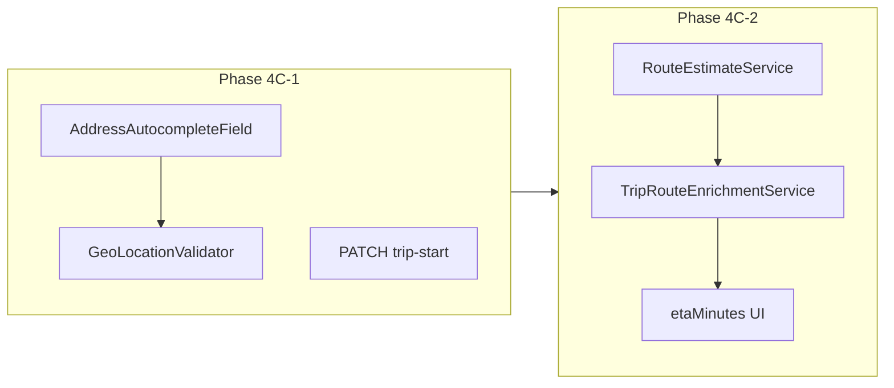
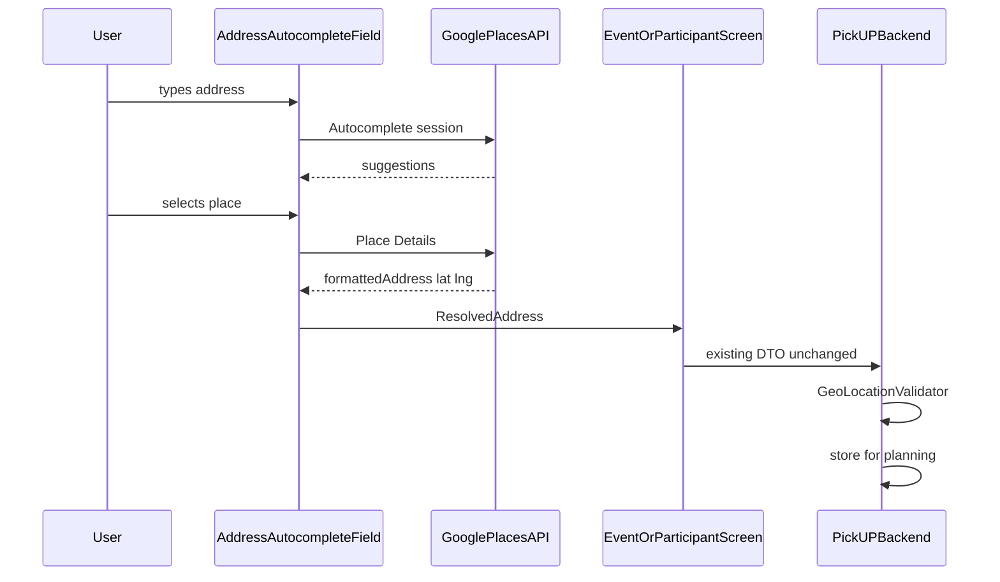

# Phase 4C — Address Intelligence, Route Estimates, and ETA Enrichment

Builds on Phase 4B ([`AutoAssignmentService`](backend/src/main/java/com/pickup/event/planning/AutoAssignmentService.java), [`DriverPassengerScorer`](backend/src/main/java/com/pickup/event/planning/DriverPassengerScorer.java), [`StopOrderPlanner`](backend/src/main/java/com/pickup/event/planning/StopOrderPlanner.java), [`DistanceCalculator`](backend/src/main/java/com/pickup/common/geo/DistanceCalculator.java)). **No schema migration.** Existing columns (`destinationAddress/Lat/Lng`, participant `pickup*`, `TripStop.etaMinutes`, `Trip.encodedPolyline`) are reused.

**Implementation is split into two stable passes:**

| Pass | Scope | Explicitly deferred |
|------|-------|---------------------|
| **4C-1** | Autocomplete UX, validation, driver trip-start | Route estimates, ETA population, scorer/planner changes |
| **4C-2** | Route layer, ETA enrichment, ETA UI | Live tracking, meeting-point engine, map SDK |



---

## Phase 4C-1 — Address Input and Validation

**Goal:** Make location entry feel like a real product. Users select addresses via autocomplete; backend enforces complete address + coordinate payloads. Driver trip start gets a first-class edit path. **No route math changes.**

### 4C-1 Backend

#### Location validation foundation

Create [`GeoLocationValidator`](backend/src/main/java/com/pickup/common/geo/GeoLocationValidator.java) (static utility, mirrors [`GoogleMapsNavigationUrlBuilder.isValidCoordinate`](backend/src/main/java/com/pickup/trip/navigation/GoogleMapsNavigationUrlBuilder.java)):

- `validateCoordinateRange(lat, lng)` — finite, lat ∈ [-90,90], lng ∈ [-180,180]
- `isComplete(String address, Double lat, Double lng)` — non-blank trimmed address + both coords
- `requireComplete(...)` — throws `BadRequestException` with field-specific message

**Wire into services** (no DTO shape changes):

| Location | File | Rule |
|----------|------|------|
| Event create | [`EventService`](backend/src/main/java/com/pickup/event/EventService.java) | `requireComplete` on destination triple |
| Event update | `EventService` | If **any** of address/lat/lng present, require **all three** after merge |
| Passenger pickup | [`EventParticipantService.setPickup`](backend/src/main/java/com/pickup/participant/EventParticipantService.java) | Already `@Valid` DTO; add service `requireComplete` |
| Driver trip start (new) | new `setTripStart` | Same validation |
| Self-join | `EventParticipantService.selfJoin` | If **any** pickup field provided, require complete triple (passenger or driver) |
| Assignment | [`AssignmentService`](backend/src/main/java/com/pickup/event/assignment/AssignmentService.java) | Keep existing passenger pickup checks; reuse `GeoLocationValidator` |

**Unit test:** `GeoLocationValidatorTest`

#### Driver trip-start API

Today drivers can only set coords via optional [`JoinEventRequest`](backend/src/main/java/com/pickup/participant/dto/JoinEventRequest.java) fields; [`setPickup`](backend/src/main/java/com/pickup/participant/EventParticipantService.java) is PASSENGER-only.

Add:

- `PATCH /api/v1/events/{eventId}/participants/{participantId}/trip-start`
- Reuse [`UpdateParticipantPickupRequest`](backend/src/main/java/com/pickup/participant/dto/UpdateParticipantPickupRequest.java) body (`pickupAddress/Lat/Lng` on entity = trip start per 4B convention)
- Authorization: driver owner only; editable states same as vehicle (`REQUESTED`, `APPROVED`, `CONFIRMED`; not `ASSIGNED`)

**4C-1 explicitly does NOT touch:** `DriverPassengerScorer`, `StopOrderPlanner`, `AutoAssignmentService` routing logic, `TripStop.etaMinutes`, `Trip.encodedPolyline`.

### 4C-1 Frontend

**New feature module:** `frontend/lib/features/location/`

| File | Purpose |
|------|---------|
| `data/places_config.dart` | Read `GOOGLE_PLACES_API_KEY` from `--dart-define` |
| `data/places_api.dart` | Dio client: Autocomplete (New) + Place Details (New); session token per search session |
| `data/resolved_address.dart` | `{ formattedAddress, lat, lng }` |
| `presentation/address_autocomplete_field.dart` | Debounced search field, suggestion list, selection → resolved coords |
| `presentation/location_picker_sheet.dart` | Thin wrapper for bottom-sheet flows |

**UX flow:**

1. User types → debounced Places Autocomplete (New) with session token.
2. User selects → Place Details → `formattedAddress`, `lat`, `lng`.
3. Parent form submits **existing DTOs unchanged**.
4. Lat/lng hidden from normal UI; optional debug expansion behind `kDebugMode` only.

**Wire into entry points:**

| Screen | File | Change |
|--------|------|--------|
| Event create | [`create_event_screen.dart`](frontend/lib/features/event/presentation/create_event_screen.dart) | Replace address + lat/lng with `AddressAutocompleteField` |
| Event destination edit | [`event_detail_screen.dart`](frontend/lib/features/event/presentation/event_detail_screen.dart) | Organizer-only "Edit destination" sheet → `EventApi.update` |
| Passenger pickup | [`pickup_address_sheet.dart`](frontend/lib/features/participant/presentation/pickup_address_sheet.dart) + `_JoinCard` | Remove duplicate manual lat/lng |
| Driver trip start | `event_detail_screen.dart` | New `_DriverTripStartRow` → `PATCH .../trip-start` |

**New frontend API:** [`participant_api.dart`](frontend/lib/features/participant/data/participant_api.dart) — `setTripStart(...)`.

**Dependency:** `uuid` for Places session tokens. No map SDK.

**4C-1 explicitly does NOT add:** ETA display UI (`etaMinutes` remains null until 4C-2).

### 4C-1 Verification

1. `mvn -f backend test` — `GeoLocationValidatorTest`
2. `flutter analyze`
3. Smoke: create event via autocomplete; passenger pickup via autocomplete; driver sets trip start; assignment + trip execution unchanged; manual lat/lng no longer required in normal flows

---

## Phase 4C-2 — Route Estimates and ETA Enrichment

**Goal:** Populate planning realism using a clean route-estimate layer. Builds on 4C-1 validated coordinates. **No changes to address UX or validation contracts.**

### 4C-2 Backend

#### Route estimate abstraction

**New package:** `com.pickup.common.geo.routing`

| Class | Role |
|-------|------|
| `TravelMetrics` record | `distanceMeters`, `durationSeconds`, `TravelEstimateSource` enum (`HAVERSINE`, `GOOGLE_ROUTES`) |
| `RouteEstimateProvider` interface | `Optional<TravelMetrics> estimate(GeoPoint origin, GeoPoint destination)` |
| `HaversineTravelProvider` | Distance via `DistanceCalculator`; duration = `distance / assumedUrbanSpeedMps` (default ~11 m/s) |
| `GoogleRoutesTravelProvider` | `@ConditionalOnProperty(pickup.google.routes.enabled=true)`; Routes API computeRoutes (DRIVE, traffic-unaware for determinism) |
| `RouteEstimateService` | Tries Google when enabled, falls back to Haversine; never throws to callers |
| `RouteLegPlanner` | Sum leg metrics for ordered waypoints |
| `MeetingPointDefaults` | Stub returning `Optional.empty()` for future recommendation engine |

**Config** in [`application.yml`](backend/src/main/resources/application.yml):

```yaml
pickup:
  google:
    routes:
      enabled: ${GOOGLE_ROUTES_ENABLED:false}
      api-key: ${GOOGLE_ROUTES_API_KEY:}
    travel:
      assumed-speed-mps: 11.0
```

Use Spring `RestClient` — no new Maven deps.

#### ETA enrichment

**New:** [`TripRouteEnrichmentService`](backend/src/main/java/com/pickup/trip/planning/TripRouteEnrichmentService.java)

Called from [`AssignmentService.submit`](backend/src/main/java/com/pickup/event/assignment/AssignmentService.java) after each new trip is built, before `save` (manual + auto paths).

**Algorithm:**

1. Route origin: driver `pickupLat/Lng` if complete; else first stop.
2. Waypoints: stops by `sequence`.
3. Final leg: last stop → destination.
4. `etaMinutes` = cumulative driving minutes from route origin to each stop.
5. Set `trip.encodedPolyline` when Google returns it (best-effort).
6. Leave `meetingPointName` null.

No refresh on trip start or stop advance in 4C-2.

#### Optional scorer/planner upgrade

Only if clean during implementation: inject `RouteEstimateService` into [`DriverPassengerScorer`](backend/src/main/java/com/pickup/event/planning/DriverPassengerScorer.java) and [`StopOrderPlanner`](backend/src/main/java/com/pickup/event/planning/StopOrderPlanner.java) so ranking uses route distance when available, Haversine fallback otherwise. Lexicographic tie-breakers unchanged.

**If refactor risks scope:** ship enrichment + ETA UI first; defer scorer/planner to end of 4C-2 or next phase.

**Unit tests:** `HaversineTravelProviderTest`, `RouteEstimateServiceTest`, `TripRouteEnrichmentServiceTest`

### 4C-2 Frontend

Surface `TripStopSummary.etaMinutes` (already parsed in [`trip_dtos.dart`](frontend/lib/features/trip/data/trip_dtos.dart)):

| Widget | Change |
|--------|--------|
| [`trip_detail_screen.dart`](frontend/lib/features/trip/presentation/trip_detail_screen.dart) `_StopTile` | `~N min from start` when populated |
| [`ordered_stop_preview.dart`](frontend/lib/features/trip/presentation/ordered_stop_preview.dart) | ETA suffix on organizer previews |
| [`event_trips_screen.dart`](frontend/lib/features/trip/presentation/event_trips_screen.dart) | Trip card total leg time subtitle |

Add `frontend/lib/core/format/eta_format.dart`.

### 4C-2 Verification

1. `mvn -f backend test` — routing + enrichment tests
2. `flutter analyze`
3. Smoke: manual + auto assignment → `GET trips` shows `etaMinutes`; Haversine fallback with Routes disabled; optional Routes enabled → road-network estimates; trip execution + navigation unchanged

---

## Files by pass

### 4C-1 — Create

**Backend:**
- `common/geo/GeoLocationValidator.java`
- `test/.../GeoLocationValidatorTest.java`

**Frontend:**
- `features/location/data/places_config.dart`
- `features/location/data/places_api.dart`
- `features/location/data/resolved_address.dart`
- `features/location/presentation/address_autocomplete_field.dart`
- `features/location/presentation/location_picker_sheet.dart`

### 4C-1 — Modify

**Backend:**
- [`EventService.java`](backend/src/main/java/com/pickup/event/EventService.java)
- [`EventParticipantService.java`](backend/src/main/java/com/pickup/participant/EventParticipantService.java)
- [`EventParticipantController.java`](backend/src/main/java/com/pickup/participant/EventParticipantController.java)
- [`AssignmentService.java`](backend/src/main/java/com/pickup/event/assignment/AssignmentService.java) — validation only

**Frontend:**
- [`pubspec.yaml`](frontend/pubspec.yaml)
- [`create_event_screen.dart`](frontend/lib/features/event/presentation/create_event_screen.dart)
- [`event_detail_screen.dart`](frontend/lib/features/event/presentation/event_detail_screen.dart)
- [`pickup_address_sheet.dart`](frontend/lib/features/participant/presentation/pickup_address_sheet.dart)
- [`participant_api.dart`](frontend/lib/features/participant/data/participant_api.dart)
- [`.env.example`](.env.example) — document `GOOGLE_PLACES_API_KEY` (frontend dart-define)

### 4C-2 — Create

**Backend:**
- `common/geo/MeetingPointDefaults.java`
- `common/geo/routing/*` (TravelMetrics, providers, RouteEstimateService, RouteLegPlanner, GoogleRoutesProperties)
- `trip/planning/TripRouteEnrichmentService.java`
- `test/.../HaversineTravelProviderTest.java`, `RouteEstimateServiceTest.java`, `TripRouteEnrichmentServiceTest.java`

**Frontend:**
- `core/format/eta_format.dart`

### 4C-2 — Modify

**Backend:**
- [`AssignmentService.java`](backend/src/main/java/com/pickup/event/assignment/AssignmentService.java) — call enrichment
- [`AutoAssignmentService.java`](backend/src/main/java/com/pickup/event/planning/AutoAssignmentService.java) — optional route-aware wiring
- [`DriverPassengerScorer.java`](backend/src/main/java/com/pickup/event/planning/DriverPassengerScorer.java) — optional
- [`StopOrderPlanner.java`](backend/src/main/java/com/pickup/event/planning/StopOrderPlanner.java) — optional
- [`application.yml`](backend/src/main/resources/application.yml), [`.env.example`](.env.example) — Routes config

**Frontend:**
- [`trip_detail_screen.dart`](frontend/lib/features/trip/presentation/trip_detail_screen.dart)
- [`ordered_stop_preview.dart`](frontend/lib/features/trip/presentation/ordered_stop_preview.dart)
- [`event_trips_screen.dart`](frontend/lib/features/trip/presentation/event_trips_screen.dart)

### Unchanged across both passes

- [`TripExecutionService`](backend/src/main/java/com/pickup/trip/TripExecutionService.java), navigation resolver, deep-link builder
- Assignment persistence model, preservation rules, manual order semantics
- Database entities / schema
- Trip/participant/event DTO shapes (no breaking changes)

---

## DTO changes

**No breaking changes in either pass.**

| Pass | DTO impact |
|------|------------|
| 4C-1 | Stricter service-layer validation only; new `PATCH .../trip-start` reuses `UpdateParticipantPickupRequest` |
| 4C-2 | `TripResponse` / `TripStopSummary` unchanged shape; `etaMinutes` and `encodedPolyline` begin populating |

---

## API contract summary

### 4C-1 (new/changed behavior)

| Method | Path | Change |
|--------|------|--------|
| `POST` | `/api/v1/events` | Rejects incomplete/invalid destination |
| `PATCH` | `/api/v1/events/{id}` | Partial destination must include full triple |
| `POST` | `/api/v1/events/{eventId}/participants` | Rejects partial location triple when any field sent |
| `PATCH` | `/api/v1/events/{eventId}/participants/{id}/pickup` | Stricter validation |
| `PATCH` | `/api/v1/events/{eventId}/participants/{id}/trip-start` | **NEW** — driver trip start |

### 4C-2 (new/changed behavior)

| Method | Path | Change |
|--------|------|--------|
| `POST` | `/api/v1/events/{eventId}/assignments` | Created trips include `stops[].etaMinutes` |
| `POST` | `/api/v1/events/{eventId}/planning/generate-assignments` | Same + optional route-aware scoring/ordering |
| `GET` | trip endpoints | `etaMinutes`, possibly `encodedPolyline` populated |

No backend geocoding/autocomplete endpoints in either pass.

---

## Schema / entity changes

**None** in either pass.

---

## Environment / dependencies

### 4C-1

| Variable | Where | Purpose |
|----------|-------|---------|
| `GOOGLE_PLACES_API_KEY` | Flutter `--dart-define` | Autocomplete + Place Details |

```bash
flutter run --dart-define=GOOGLE_PLACES_API_KEY=your-key
```

Frontend dep: `uuid`.

### 4C-2

| Variable | Where | Purpose |
|----------|-------|---------|
| `GOOGLE_ROUTES_API_KEY` | Backend env | Routes API (optional) |
| `GOOGLE_ROUTES_ENABLED` | Backend env | `true` to activate Google provider |

GCP APIs: Places API (New) for 4C-1; Routes API for 4C-2.

---

## Address autocomplete architecture (4C-1)



- Frontend owns interactive search; backend owns validation + storage.
- 4C-2 route math consumes the same stored coordinates — no UX changes between passes.

---

## Intentional TODOs for next phase

- Live ETA refresh on trip start / stop advance
- Meeting-point recommendation engine
- Fairness balancing across drivers
- Backend Places proxy (web/desktop key restrictions)
- `GET /planning/status` async generation
- Traffic-aware routing
- Persist per-stop `navigationLink`
- Full map picker UI
