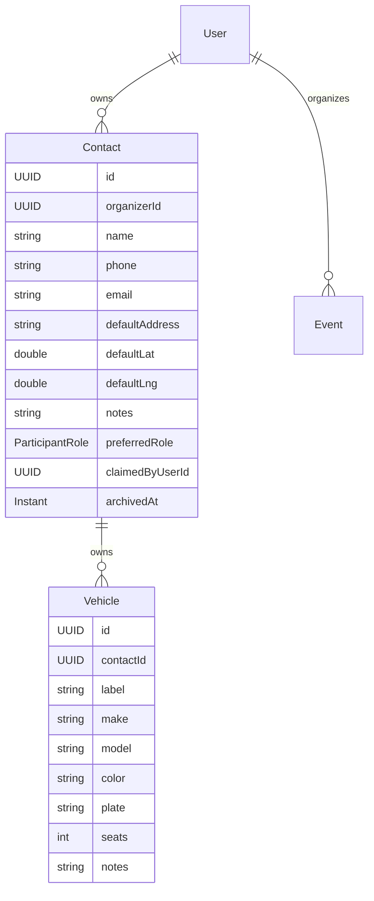

# Phase 4D-1 — Contact / People Roster

Organizer-owned reusable Contacts + contact-owned Vehicles. No add-to-event, assignment, trip driver FK, or nav-hiding work in this phase.

**Locked decisions for this phase**
- Event location save-back: not in scope (no Contact auto-update from events)
- Soft archive Contacts (`archivedAt`); list active only
- Single default address triad on Contact; UI labels by preferred-role hint
- `preferredRole` optional UX hint only
- `claimedByUserId` nullable column only (no claim flow)
- Add `READY` to `ParticipantStatus` enum (unused until 4D-2)
- Wipe local DB OK; Flyway owns schema going forward (`ddl-auto: validate`)
- Seed: **organizer-first only** — `john@test.com` + sample Contacts/vehicles; demo event organizer-only; drop multi-user driver/passenger seed accounts



---

## 1. Flyway + schema

### Build / config
- Add `flyway-core` + `flyway-database-postgresql` to [`backend/pom.xml`](backend/pom.xml)
- In [`application.yml`](backend/src/main/resources/application.yml) (and local/docker overrides as needed):
  - `spring.jpa.hibernate.ddl-auto: validate`
  - `spring.flyway.enabled: true`
  - `spring.flyway.locations: classpath:db/migration`
- Document wipe: `docker compose down -v && docker compose up --build` (or drop/recreate local `pickup` DB)

### Migration strategy (greenfield wipe)
Because local data need not be preserved, ship **one baseline** that creates the full 4D-1 schema (existing tables + Contacts + contact-owned vehicles), not an alter-from-Hibernate-auto schema.

Create [`backend/src/main/resources/db/migration/V1__baseline_4d1.sql`](backend/src/main/resources/db/migration/V1__baseline_4d1.sql) including:

**Existing tables (mirror current JPA shape)**  
`users`, `user_system_roles`, `events`, `event_participants` (still `user_id NOT NULL`), `trips` (still `driver_id → users`), `trip_stops`, `notifications`, plus indexes/FKs/uniques matching current entities.

**New `contacts`**
- Columns: `id`, `organizer_id NOT NULL → users`, `name NOT NULL`, `phone`, `email`, `default_address`, `default_lat`, `default_lng`, `notes`, `preferred_role` (varchar 32, nullable), `claimed_by_user_id NULL → users`, `archived_at`, `created_at`, `updated_at`
- Index `(organizer_id)` where `archived_at IS NULL` (or plain organizer_id index)

**`vehicles` ownership move**
- `contact_id NOT NULL → contacts(id)` — **no `owner_id`**
- Add `label`, `notes` (nullable text)
- Keep `make`, `model`, `color`, `plate`, `seats`, timestamps
- Index `(contact_id)`

Do **not** change `event_participants.user_id` nullability or `trips.driver_id` in this migration.

---

## 2. Backend domain: Contact

New package `com.pickup.contact`:

| File | Purpose |
|------|---------|
| `ContactEntity.java` | JPA entity extending `BaseEntity` |
| `ContactRepository.java` | `findAllByOrganizerIdAndArchivedAtIsNullOrderByNameAsc`, `findByIdAndOrganizerId`, … |
| `ContactService.java` | CRUD + archive + ownership checks |
| `ContactMapper.java` | Entity → response |
| `ContactController.java` | `/api/v1/contacts` |
| `dto/ContactResponse.java` | API read model |
| `dto/CreateContactRequest.java` | create body |
| `dto/UpdateContactRequest.java` | patch body |

**Entity fields:** match schema; `preferredRole` as nullable `ParticipantRole`; `claimedByUser` as lazy nullable `UserEntity` (unused in services).

**Validation rules**
- `name` required (1–120)
- phone/email/notes optional with size caps
- Default location: either all null, or complete via existing [`GeoLocationValidator`](backend/src/main/java/com/pickup/common/geo/GeoLocationValidator.java) (`defaultAddress` + lat/lng)
- `preferredRole` if present: `DRIVER | PASSENGER | INDEPENDENT_ATTENDEE` only (reject `ORGANIZER`)

**Service behavior**
- All ops scoped to `CurrentUser` as `organizerId`
- `DELETE` → set `archivedAt = now` (idempotent if already archived)
- List excludes archived
- Get-by-id: allow archived fetch only if useful for history; **v1: 404 archived** on GET/PATCH/vehicles (simple); archive is terminal for UI

**Enum prep (tiny, unused)**  
Add `READY` to [`ParticipantStatus.java`](backend/src/main/java/com/pickup/common/enums/ParticipantStatus.java).

---

## 3. Vehicle ownership migration (backend)

### Entity / repo / DTOs
Update [`VehicleEntity.java`](backend/src/main/java/com/pickup/vehicle/VehicleEntity.java):
- Replace `owner: UserEntity` with `contact: ContactEntity` (`contact_id`, required)
- Add `label`, `notes`

Update [`VehicleRepository.java`](backend/src/main/java/com/pickup/vehicle/VehicleRepository.java):
- `findAllByContactIdOrderByCreatedAtAsc`
- `findByIdAndContactId`
- Remove `findAllByOwnerId*` / `findByIdAndOwnerId`

Update DTOs:
- [`VehicleResponse`](backend/src/main/java/com/pickup/vehicle/dto/VehicleResponse.java): `contactId`, `label`, `notes` (drop `ownerId`)
- [`CreateVehicleRequest`](backend/src/main/java/com/pickup/vehicle/dto/CreateVehicleRequest.java) / [`UpdateVehicleRequest`](backend/src/main/java/com/pickup/vehicle/dto/UpdateVehicleRequest.java): add optional `label`, `notes`; keep make/model/seats required on create

### Contact-scoped vehicle API (primary)
Nest under Contact controller or `ContactVehicleController`:

```
GET    /api/v1/contacts/{contactId}/vehicles
POST   /api/v1/contacts/{contactId}/vehicles
PATCH  /api/v1/contacts/{contactId}/vehicles/{vehicleId}
DELETE /api/v1/contacts/{contactId}/vehicles/{vehicleId}
```

AuthZ: contact must belong to current organizer and not be archived.

Delete rules (same spirit as today): block if referenced by trips; clear participant vehicle FK via existing `clearVehicleByVehicleId` before delete.

### Legacy `/api/v1/vehicles` (compile, don’t expand)
Keep [`VehicleController`](backend/src/main/java/com/pickup/vehicle/VehicleController.java) compiling:
- `GET/POST/PATCH/DELETE /vehicles` → respond with **`400 BadRequest`** (or `409`) and a clear message: vehicles are managed under Contacts
- Refactor [`VehicleService`](backend/src/main/java/com/pickup/vehicle/VehicleService.java) into contact-scoped methods used by the new API; legacy entrypoints call the stub errors
- [`EventParticipantService.setVehicle`](backend/src/main/java/com/pickup/participant/EventParticipantService.java) currently calls `vehicleService.requireOwnedBy(vehicleId, currentUserId)` — change `requireOwnedBy` to authorize when `vehicle.contact.organizerId == currentUserId` **or** throw a clear conflict that user-owned garage is gone. Prefer organizer-via-contact check so the method remains meaningful for 4D-2 organizer edits; legacy driver self-serve vehicle attach will fail closed (acceptable; UI hidden later).

Update unit helpers ([`PlanningTestSupport`](backend/src/test/java/com/pickup/event/planning/PlanningTestSupport.java)) to build vehicles without user owner (contact null OK for non-persistent unit fixtures).

---

## 4. API contracts (4D-1)

### Contact

`POST /api/v1/contacts`
```json
{
  "name": "Craig",
  "phone": "+1...",
  "email": "craig@example.com",
  "defaultAddress": "100 Van Ness Ave, San Francisco, CA",
  "defaultLat": 37.7759,
  "defaultLng": -122.4194,
  "notes": "Usually free after 5",
  "preferredRole": "DRIVER"
}
```

`PATCH /api/v1/contacts/{id}` — all fields optional; null/blank clears optional strings where appropriate; location triad validated as a unit when any part sent.

`ContactResponse`
```json
{
  "id": "...",
  "name": "Craig",
  "phone": "...",
  "email": "...",
  "defaultAddress": "...",
  "defaultLat": 37.7759,
  "defaultLng": -122.4194,
  "notes": "...",
  "preferredRole": "DRIVER",
  "vehicleCount": 1,
  "archivedAt": null,
  "createdAt": "...",
  "updatedAt": "..."
}
```

`DELETE` → `204` / `ApiResponse` ok with archived contact (match existing API style).

### Vehicle (under contact)

Create body: `label?`, `make`, `model`, `color?`, `plate?`, `seats`, `notes?`  
Response: `id`, `contactId`, `label`, `make`, `model`, `color`, `plate`, `seats`, `notes`, `createdAt`

---

## 5. Frontend — People section

New feature folder `frontend/lib/features/people/`:

| File | Role |
|------|------|
| `data/contact_api.dart` | Dio client for `/contacts` + nested vehicles |
| `data/contact_dtos.dart` | Contact + vehicle models / JSON |
| `presentation/people_list_screen.dart` | Roster list |
| `presentation/contact_form_screen.dart` | Create/edit |
| `presentation/contact_detail_screen.dart` | Detail + vehicles + archive |

### Routes ([`route_paths.dart`](frontend/lib/core/router/route_paths.dart), [`app_router.dart`](frontend/lib/core/router/app_router.dart))
- `/people` — list
- `/people/new` — create
- `/people/:id` — detail
- `/people/:id/edit` — edit

### Navigation (additive only)
- Add People action on [`organizer_dashboard_screen.dart`](frontend/lib/features/organizer/presentation/organizer_dashboard_screen.dart) AppBar
- Do **not** remove Browse Events / My Trips / legacy vehicle garage routes in this phase

### Places reuse
- On contact form, use existing [`AddressAutocompleteField`](frontend/lib/features/location/presentation/address_autocomplete_field.dart)
- Label from `preferredRole`:
  - `DRIVER` → “Default start location”
  - `PASSENGER` / default → “Default pickup location”
  - unset → “Default location”
- Persist resolved address → `defaultAddress/Lat/Lng`

### Contact vehicles UI
- On detail: list vehicles, add/edit via form or bottom sheet (reuse patterns from [`vehicle_form_screen.dart`](frontend/lib/features/vehicle/presentation/vehicle_form_screen.dart) but call contact-scoped APIs — prefer a people-local form rather than wiring legacy `/vehicles` routes)
- Fields: label, make, model, color, plate, seats, notes
- Show seats with helper text: “Total seats including driver”

### Legacy FE vehicle garage
- Leave files/routes compiling; no new links from People. Profile/dashboard links to `/vehicles` can stay until 4D-4.

---

## 6. Dev seed + README

Rewrite [`DevSeedService`](backend/src/main/java/com/pickup/dev/DevSeedService.java):
1. Ensure organizer `john@test.com` / password `test`
2. Create Contacts owned by John (e.g. Jack, Jacob as preferred DRIVER with vehicles + start addresses; Dell/James/Emma/… as preferred PASSENGER with pickup defaults — same SF fixtures as today)
3. Attach Vehicles to driver contacts (Toyota Corolla / Honda Civic specs)
4. Demo event: create/find “PickUP Demo Event” with organizer participant only (no user-backed drivers/passengers)
5. `DevSeedResponse` / account list: document single login; optionally list seeded contact names in response notes or extend DTO lightly

Update [`README.md`](README.md) demo accounts table accordingly.

---

## 7. Tests

Backend:
- `ContactServiceTest` or `@SpringBootTest` / slice tests: create/list/update/archive ownership isolation; incomplete location rejected; archived excluded from list
- Contact vehicle tests: CRUD under contact; cannot access another organizer’s contact; delete blocked when trip-referenced (can mock/stub trip repo like existing vehicle tests if present)
- Fix compile breakages in planning tests after VehicleEntity change
- Ensure Flyway migrations apply on testcontext — use `spring.flyway.enabled=true` + Testcontainers **or** H2 only if dialect-compatible; if project currently uses plain `@SpringBootTest` without Testcontainers, follow existing test datasource pattern and adjust so validate+Flyway succeeds (inspect current test `application` properties when implementing)

Frontend:
- `flutter analyze` clean for new people feature
- No requirement for widget tests in 4D-1 unless quick smoke is free

---

## 8. Exact files to create / modify

### Create
- `backend/src/main/resources/db/migration/V1__baseline_4d1.sql`
- `backend/src/main/java/com/pickup/contact/ContactEntity.java`
- `backend/src/main/java/com/pickup/contact/ContactRepository.java`
- `backend/src/main/java/com/pickup/contact/ContactService.java`
- `backend/src/main/java/com/pickup/contact/ContactMapper.java`
- `backend/src/main/java/com/pickup/contact/ContactController.java`
- `backend/src/main/java/com/pickup/contact/dto/ContactResponse.java`
- `backend/src/main/java/com/pickup/contact/dto/CreateContactRequest.java`
- `backend/src/main/java/com/pickup/contact/dto/UpdateContactRequest.java`
- `backend/src/main/java/com/pickup/contact/ContactVehicleController.java` (or nest in ContactController)
- `backend/src/test/java/com/pickup/contact/ContactServiceTest.java` (and vehicle tests as needed)
- `frontend/lib/features/people/data/contact_api.dart`
- `frontend/lib/features/people/data/contact_dtos.dart`
- `frontend/lib/features/people/presentation/people_list_screen.dart`
- `frontend/lib/features/people/presentation/contact_form_screen.dart`
- `frontend/lib/features/people/presentation/contact_detail_screen.dart`
- people vehicle form widget/sheet as needed under `presentation/`

### Modify
- [`backend/pom.xml`](backend/pom.xml) — Flyway deps
- [`application.yml`](backend/src/main/resources/application.yml) / [`application-local.yml`](backend/src/main/resources/application-local.yml) / [`application-docker.yml`](backend/src/main/resources/application-docker.yml) — ddl-auto validate + flyway
- [`VehicleEntity.java`](backend/src/main/java/com/pickup/vehicle/VehicleEntity.java), [`VehicleRepository.java`](backend/src/main/java/com/pickup/vehicle/VehicleRepository.java), [`VehicleService.java`](backend/src/main/java/com/pickup/vehicle/VehicleService.java), [`VehicleMapper.java`](backend/src/main/java/com/pickup/vehicle/VehicleMapper.java), vehicle DTOs, [`VehicleController.java`](backend/src/main/java/com/pickup/vehicle/VehicleController.java)
- [`EventParticipantService.java`](backend/src/main/java/com/pickup/participant/EventParticipantService.java) — ownership helper compile fix
- [`ParticipantStatus.java`](backend/src/main/java/com/pickup/common/enums/ParticipantStatus.java) — add `READY`
- [`DevSeedService.java`](backend/src/main/java/com/pickup/dev/DevSeedService.java) (+ DTO/README if needed)
- [`PlanningTestSupport.java`](backend/src/test/java/com/pickup/event/planning/PlanningTestSupport.java) and any vehicle-owner tests
- Frontend: [`route_paths.dart`](frontend/lib/core/router/route_paths.dart), [`app_router.dart`](frontend/lib/core/router/app_router.dart), [`organizer_dashboard_screen.dart`](frontend/lib/features/organizer/presentation/organizer_dashboard_screen.dart)
- Frontend vehicle DTOs if shared types conflict (`ownerId` → tolerate or leave legacy garage broken until 4D-4)
- [`README.md`](README.md) — Flyway wipe note + demo seed

### Explicitly out of scope (4D-2+)
- `EventParticipant.contact_id` / nullable `user_id`
- Add-from-contacts APIs
- Assignment / `Trip.driverParticipant`
- Hiding browse/join/my-trips/driver/passenger UX
- Trip share sheet
- Contact claim / public trip links
- “Save as default” from event edits

---

## 9. Verification checklist

1. `docker compose down -v && docker compose up --build` — Flyway V1 applies; app starts; seed creates John + contacts
2. Login as john → People → create/edit Contact with autocomplete default location → add vehicle → archive contact (disappears from list)
3. `mvn test` green; `flutter analyze` green
4. Legacy `/api/v1/vehicles` returns clear error; legacy FE garage not linked from People
5. Existing assignment endpoints still compile; demo event has no contact participants yet (expected)
