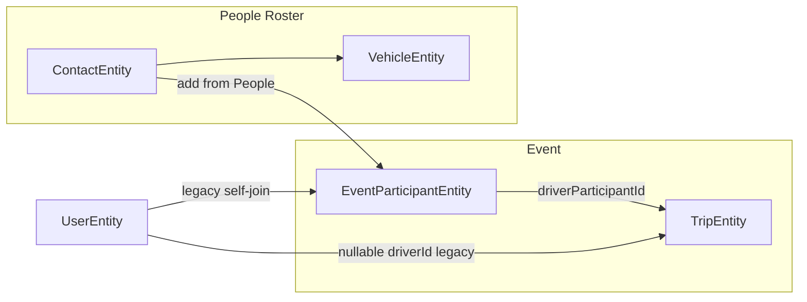

# Phase 4D-2 — Add Contacts to Events

**Status:** Approved — ready for implementation

## Locked clarifications (pre-implementation)

1. **Remove from Event** sets participant status to `CANCELLED` (soft remove). Do **not** hard-delete `EventParticipant` rows — preserve historical event participation. Re-adding a previously cancelled contact should reactivate the existing row.

2. **Bulk `from-contacts` is atomic.** One `@Transactional` method; if any entry fails validation or is a duplicate, the entire operation rolls back — no partial roster.

3. **Contact default location is copied only at participant creation.** Organizer edits to event pickup/vehicle remain event-local and never write back to `Contact`.

4. **Driver readiness:**
   - A `DRIVER` may exist on the event **without** a vehicle.
   - UI shows a clear **"Vehicle required before assignment"** warning when vehicle is missing.
   - Manual and auto assignment **reject** drivers without a valid selected vehicle (existing backend rule preserved).

5. **Minimum assignment/trip compatibility is in scope** for E2E exit: People → Add to Event → READY → Assign → Trips.

6. **Contact-only driver execution/auth remains deferred** (4D-3). Organizer monitors trips; drivers are not active app users.

---

## Problem

After 4D-1, organizers can maintain a People roster but **cannot add anyone to an event**. [`EventParticipantEntity`](backend/src/main/java/com/pickup/participant/EventParticipantEntity.java) still requires `user_id NOT NULL`, and [`EventParticipantMapper`](backend/src/main/java/com/pickup/participant/EventParticipantMapper.java) always reads `entity.getUser()` — contact-only rows would NPE. Assignment also fails for contact drivers because [`AssignmentService`](backend/src/main/java/com/pickup/event/assignment/AssignmentService.java) sets `.driver(va.driver().getUser())` on [`TripEntity`](backend/src/main/java/com/pickup/trip/TripEntity.java).

## Locked product rules

- Organizer-added contacts become **`READY` immediately** (no REQUESTED/APPROVED flow)
- Event-specific pickup/vehicle overrides stay on `EventParticipant`; **do not write back** to Contact
- Drivers may be added **without a vehicle**; assignment rejects until vehicle is set
- Contact `preferredRole` is a **UI pre-fill hint only**; role is chosen per event at add time
- Legacy self-join (`POST /participants`) remains for now (hidden in UI is 4D-4)

## Architecture

**Identity rule:** each participant row has **exactly one** origin — `user_id` XOR `contact_id`.

**Remove rule:** organizer "Remove from event" → `CANCELLED` (not DELETE).

## Implementation todos

- [ ] V2 migration: `contact_id`, nullable `user_id`, `driver_participant_id`, nullable `driver_id`
- [ ] Entity/repo/mapper/DTOs + `addFromContact(s)` (atomic bulk) + `organizerUpdate` + cancel-based remove
- [ ] READY in assignable states; `TripEntity.driverParticipant`; mapper/navigation fixes
- [ ] Frontend: Add from People, contact tiles, edit sheet, vehicle-required warning
- [ ] Frontend assignment: READY assignable, match by `driverParticipantId`
- [ ] Dev seed + tests + README

## Out of scope (later)

- Hiding legacy browse/join UX (4D-4)
- Trip share / contact claim
- Save-as-default from event edits
- Contact-only driver execution (4D-3)
