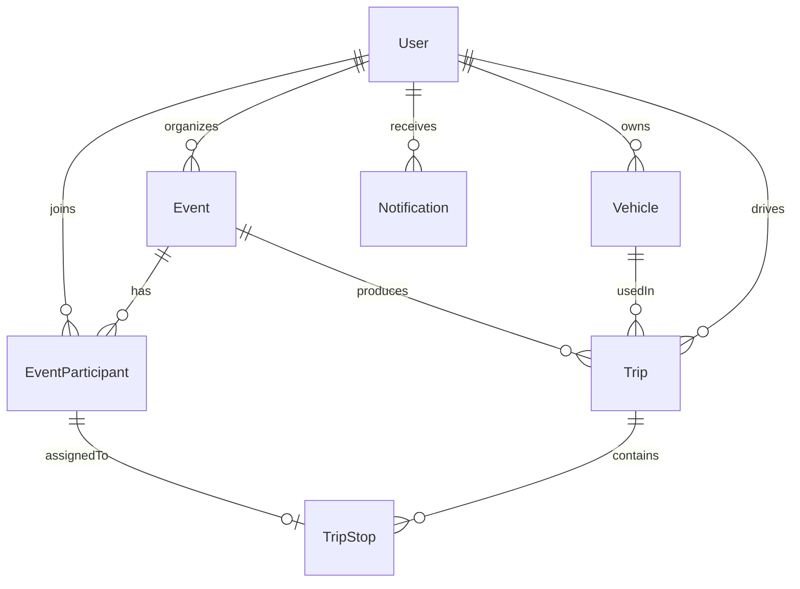

## 1. Repository Layout

```text
PickUP/
├── backend/                      # Spring Boot 3, Java 21, Maven
├── frontend/                     # Flutter app
├── docker/                       # init scripts, etc.
├── docker-compose.yml            # postgres + backend (+ pgadmin optional)
├── .env.example                  # DB creds, JWT secret
├── .gitignore
└── README.md
```

### Backend (`backend/`)

```text
backend/
├── Dockerfile                    # multi-stage: maven build -> jre runtime
├── pom.xml
├── mvnw, mvnw.cmd, .mvn/
└── src/main/
    ├── java/com/pickup/
    │   ├── PickUpApplication.java
    │   ├── config/               # SecurityConfig, CorsConfig, JpaAuditingConfig, WebSocketConfig (stub)
    │   ├── common/
    │   │   ├── api/              # ApiResponse<T>, PageResponse<T>, ApiError
    │   │   ├── exception/        # GlobalExceptionHandler, BaseException, NotFoundException, ConflictException, UnauthorizedException
    │   │   ├── enums/            # SystemRole, EventStatus, EventPlanningStatus, ParticipantRole, ParticipantStatus, TripStatus, StopStatus, NotificationType
    │   │   └── domain/           # BaseEntity (id, createdAt, updatedAt via @MappedSuperclass)
    │   ├── security/             # JwtTokenProvider, JwtAuthenticationFilter, CustomUserDetailsService, PasswordConfig
    │   ├── user/                 # UserEntity, UserRepository, UserService, UserController, dto/
    │   ├── auth/                 # AuthController, AuthService, dto/ (LoginRequest, RegisterRequest, TokenResponse)
    │   ├── event/                # EventEntity, ...
    │   ├── participant/          # EventParticipantEntity, ...
    │   ├── vehicle/              # VehicleEntity, ...
    │   ├── trip/                 # TripEntity, ...
    │   ├── tripstop/             # TripStopEntity, ...
    │   └── notification/         # NotificationEntity, ...
    └── resources/
        ├── application.yml
        ├── application-local.yml
        └── application-docker.yml
```

### Frontend (`frontend/`)

```text
frontend/lib/
├── main.dart                     # runApp(ProviderScope(child: PickUpApp()))
├── app.dart                      # MaterialApp.router + theme + router providers
├── core/
│   ├── theme/                    # app_theme.dart (light/dark ColorSchemes, text theme)
│   ├── router/                   # app_router.dart (go_router) + route_paths.dart
│   ├── network/                  # api_client.dart (dio + interceptor for JWT)
│   └── storage/                  # secure_token_storage.dart (flutter_secure_storage)
├── features/
│   ├── splash/presentation/splash_screen.dart
│   ├── auth/presentation/login_screen.dart
│   ├── profile/presentation/profile_screen.dart
│   ├── organizer/presentation/organizer_dashboard_screen.dart
│   ├── event/presentation/event_detail_screen.dart
│   ├── driver/presentation/driver_trip_screen.dart
│   └── passenger/presentation/passenger_ride_screen.dart
└── shared/
    ├── widgets/                  # placeholder common widgets
    └── providers/                # auth_provider.dart, dio_provider.dart (Riverpod)
```

## 2. Domain Entities & Relationships



### Entity field summary

> Identity vs. event role: `User.systemRoles` only carries platform-level authorization (`USER`, `ADMIN`). Whether a given user is an organizer, driver, passenger, or independent attendee is **per-event** and lives on `EventParticipant.role`. The same user can be a `DRIVER` in one event and an `INDEPENDENT_ATTENDEE` in another.

- **User**: `id (UUID)`, `email (unique)`, `passwordHash`, `fullName`, `phone`, `systemRoles Set<SystemRole>` (`USER`/`ADMIN` only), `fcmToken?`, `createdAt`, `updatedAt`.
- **Vehicle**: `id`, `owner -> User`, `make`, `model`, `color`, `plate`, `seats`, `createdAt`.
- **Event**: `id`, `organizer -> User`, `title`, `description`, `destinationAddress`, `destinationLat`, `destinationLng`, `eventTime`, `status EventStatus` (lifecycle only), `planningStatus EventPlanningStatus` (separate from lifecycle), `assignmentGenerated boolean` (quick flag, default `false`), `createdAt`.
- **EventParticipant**: `id`, `event -> Event`, `user -> User`, `role ParticipantRole`, `status ParticipantStatus`, `pickupAddress?`, `pickupLat?`, `pickupLng?`, `vehicle? -> Vehicle` (only meaningful when `role = DRIVER`).
- **Trip**: `id`, `event -> Event`, `driver -> User`, `vehicle -> Vehicle`, `status TripStatus`, `currentStop? -> TripStop` (`currentStopId`, nullable FK to track active stop), `finalDestinationAddress`, `finalDestinationLat`, `finalDestinationLng` (snapshot of event destination so trips remain self-contained even if event destination changes), `encodedPolyline?` (placeholder for future Google Routes response), `startedAt?`, `completedAt?`, `stops List<TripStop>` (ordered by `sequence`).
- **TripStop**: `id`, `trip -> Trip`, `participant -> EventParticipant`, `sequence (int)`, `address`, `meetingPointName?` (e.g. "Main Lobby", "North Gate"), `lat`, `lng`, `status StopStatus`, `etaMinutes?`, `actualArrivalTime?`, `actualDepartureTime?`, `navigationLink?` (placeholder for future Google Maps deep link, populated in a later phase).
- **Notification** (intentionally minimal in Phase 1): `id`, `recipient -> User`, `type NotificationType`, `title`, `body`, `payloadJson?` (optional `jsonb` column, no heavy schema yet), `readAt?`, `createdAt`. No delivery channels, no FCM wiring.

### Enums

- `SystemRole` (global identity only): `USER, ADMIN`.
- `EventStatus` (lifecycle only — keep small): `DRAFT, OPEN, CLOSED, IN_PROGRESS, COMPLETED, CANCELLED`.
- `EventPlanningStatus` (orthogonal to lifecycle): `NOT_STARTED, IN_PROGRESS, READY, FAILED`. Combined with the boolean `assignmentGenerated` flag, this captures auto-assignment progress without overloading `EventStatus`.
- `ParticipantRole`: `ORGANIZER, DRIVER, PASSENGER, INDEPENDENT_ATTENDEE`.
- `ParticipantStatus`: `INVITED, REQUESTED, APPROVED, REJECTED, CONFIRMED, ASSIGNED, CHECKED_IN, PICKED_UP, ARRIVED, CANCELLED, NO_SHOW`.
- `TripStatus`: `ASSIGNED, STARTED, IN_PROGRESS, WAITING_FOR_NEXT_STOP, ALL_PASSENGERS_PICKED, HEADING_TO_DESTINATION, COMPLETED, INTERRUPTED`.
- `StopStatus`: `PENDING, ACTIVE, NAVIGATING, ARRIVED, PICKED_UP, CANCELLED, SKIPPED`.
- `NotificationType`: `TRIP_ASSIGNED, PICKUP_INCOMING, EVENT_UPDATE, GENERIC`.

> Phase 1 only declares these enums and stores their values; the state machines that transition between them are deferred to later phases.

## 3. High-Level API Plan (`/api/v1`)

- **Auth**: `POST /auth/register`, `POST /auth/login`, `POST /auth/refresh`, `POST /auth/logout`
- **Users**: `GET /users/me`, `PATCH /users/me`, `POST /users/me/fcm-token`
- **Vehicles**: `GET /vehicles`, `POST /vehicles`, `PATCH /vehicles/{id}`, `DELETE /vehicles/{id}`
- **Events**: `POST /events`, `GET /events`, `GET /events/{id}`, `PATCH /events/{id}`, `DELETE /events/{id}`, `POST /events/{id}/close` (lifecycle: `OPEN` -> `CLOSED`), `POST /events/{id}/planning/generate-assignments` (planning track only, sets `planningStatus` / `assignmentGenerated` — algorithm itself is a later phase)
- **Participants**: `POST /events/{id}/participants`, `GET /events/{id}/participants`, `PATCH /events/{id}/participants/{pid}`, `DELETE /events/{id}/participants/{pid}`
- **Trips**: `GET /events/{id}/trips`, `GET /trips/{id}`, `POST /trips/{id}/start`, `POST /trips/{id}/complete`, `PATCH /trips/{id}/stops/{stopId}`
- **Notifications**: `GET /notifications`, `POST /notifications/{id}/read`
- **WebSocket (STOMP)**: endpoint `/ws`; topics `/topic/trips/{tripId}`, `/topic/events/{eventId}`, `/user/queue/notifications`

All responses wrapped in:

```json
{ "success": true, "data": { ... }, "error": null, "timestamp": "..." }
```

## 4. Flutter Routing & Pages (go_router)

- `/` → `SplashScreen` (entry route; reads `authProvider`, decides next route)
- `/login` → `LoginScreen`
- `/profile` → `ProfileScreen` (placeholder for account management)
- `/organizer` → `OrganizerDashboardScreen`
- `/events/:id` → `EventDetailScreen`
- `/driver/trips/:tripId` → `DriverTripScreen`
- `/passenger/rides/:tripId` → `PassengerRideScreen`

Redirect rules (in `app_router.dart`):
- While auth state is loading → stay on `/` (splash).
- Unauthenticated and not on `/login` → redirect to `/login`.
- Authenticated and on `/login` or `/` → redirect to `/organizer` (Phase 1 default landing).

## 5. Code Skeletons To Create (Phase 1 deliverables)

### Backend
- `pom.xml` with: `spring-boot-starter-web`, `-data-jpa`, `-security`, `-validation`, `-websocket`, `postgresql`, `jjwt-api/impl/jackson`, `lombok`, `spring-boot-devtools`.
- `PickUpApplication.java` with `@SpringBootApplication`, `@EnableJpaAuditing`.
- `application.yml` + `application-docker.yml` (datasource via env, `jpa.hibernate.ddl-auto: update` for Phase 1, JWT secret/ttl).
- `common/api/ApiResponse.java` (generic wrapper + static `ok`/`fail` factories).
- `common/exception/GlobalExceptionHandler.java` (`@RestControllerAdvice` mapping `BaseException`, `MethodArgumentNotValidException`, `AccessDeniedException`, fallback `Exception`).
- `common/domain/BaseEntity.java` (`@MappedSuperclass`, `@CreatedDate`, `@LastModifiedDate`).
- `common/enums/*.java` for the enums above.
- `security/SecurityConfig.java` (stateless, disable CSRF, permit `/api/v1/auth/**` and `/ws/**`, JWT filter before `UsernamePasswordAuthenticationFilter`).
- `security/JwtTokenProvider.java` + `JwtAuthenticationFilter.java` (skeleton signatures, return `TODO` on validation paths).
- One entity file per domain object with JPA annotations and relationships only (no service logic).
- One empty `@RestController` per module returning `501 Not Implemented` placeholders, so the route plan compiles end-to-end.

### Frontend
- `pubspec.yaml` deps: `flutter_riverpod`, `go_router`, `dio`, `flutter_secure_storage`, `freezed_annotation`, `json_annotation` + dev: `build_runner`, `freezed`, `json_serializable`, `riverpod_generator`.
- `main.dart` → `runApp(ProviderScope(child: PickUpApp()))`.
- `app.dart` → `MaterialApp.router(theme: AppTheme.light, darkTheme: AppTheme.dark, routerConfig: ref.watch(routerProvider))`.
- `core/theme/app_theme.dart` (Material 3 ColorScheme seed, typography).
- `core/router/app_router.dart` (Riverpod-provided `GoRouter` with the 7 routes above + auth redirect stub).
- `core/network/api_client.dart` (dio with `baseUrl` from `--dart-define`, interceptor to attach JWT from `secure_token_storage`).
- 7 placeholder screens (Scaffold + AppBar + centered Text + a button hinting next nav target).

### Docker
- `backend/Dockerfile`: stage 1 `maven:3.9-eclipse-temurin-21` build, stage 2 `eclipse-temurin:21-jre` runtime, `EXPOSE 8080`.
- `docker-compose.yml`: services `postgres` (`postgres:16-alpine`, named volume, healthcheck) and `backend` (depends_on healthy postgres, env from `.env`).
- `.env.example`: `POSTGRES_DB=pickup`, `POSTGRES_USER`, `POSTGRES_PASSWORD`, `JWT_SECRET`, `JWT_EXPIRATION_MS`.

## 6. Phase 1 Implementation Notes (Architecture-Only)

Phase 1 is intentionally architecture-only. The following are **explicitly out of scope** and will be addressed in later phases:

- **Real auth flow**: no real token issuance / validation / refresh rotation / password reset. `JwtTokenProvider` and `JwtAuthenticationFilter` are skeletons that compile but return TODO placeholders; `AuthController` endpoints return `501 Not Implemented`.
- **Route optimization**: no Google Route Optimization API integration; no auto-assignment algorithm. `POST /events/{id}/planning/generate-assignments` exists only as a stub.
- **Google Maps integration**: no Places, Routes, or Maps SDK calls. `TripStop.navigationLink` and `Trip.encodedPolyline` are nullable placeholder fields that stay empty in Phase 1.
- **FCM integration**: no Firebase wiring on backend or Flutter. `User.fcmToken` is just a column; `POST /users/me/fcm-token` is a stub.
- **Chat system**: no messaging entities, no `ChatMessage`, no chat endpoints, no chat WebSocket topics.
- **Full business logic**: no participant invitation/approval flow, no trip orchestration, no state-machine transitions between any of the new `ParticipantStatus` / `TripStatus` / `StopStatus` values. Controllers return `501` so the route surface is verifiable end-to-end.
- **State-machine enforcement**: the enums are declared and persisted, but transitions are not guarded yet.
- **WebSocket handlers**: only the `/ws` STOMP endpoint and broker prefixes are configured; no message mappings.
- **Database migrations**: `spring.jpa.hibernate.ddl-auto=update` for Phase 1. Flyway is introduced in Phase 2 before any real data exists.
- **Flutter state**: only a stub `authProvider`; placeholder screens render static UI and do **not** call the backend yet.

### Consistency with later modules

The Phase 1 design is shaped to absorb later phases without refactoring:

- Per-event `ParticipantRole` (not global) → ride-assignment module can flip a user between `DRIVER` / `PASSENGER` / `INDEPENDENT_ATTENDEE` per event without identity changes.
- `EventStatus` (lifecycle) vs. `EventPlanningStatus` + `assignmentGenerated` (planning track) → assignment generation can run, fail, and retry without polluting the event lifecycle.
- `Trip.currentStopId` + rich `TripStop` timing fields (`actualArrivalTime`, `actualDepartureTime`) + `meetingPointName` → trip-execution module can drive the step-by-step UI directly off these fields.
- `Trip.finalDestination*` snapshot fields → trips remain self-contained even if the parent `Event` destination is later edited.
- `TripStop.navigationLink` + `Trip.encodedPolyline` → Google Maps deep-link / Routes API integration drops in without schema changes.
- Verbose `ParticipantStatus` and `TripStatus` enums → state-machine module in a later phase can implement transitions without enum migrations.
