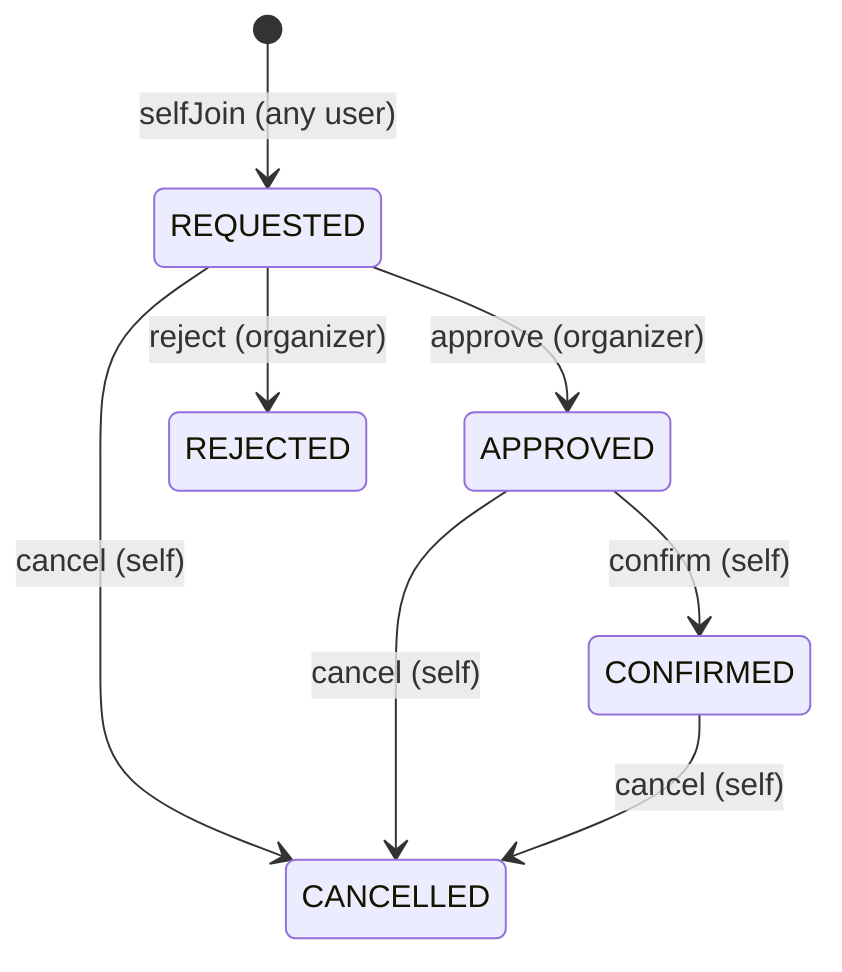

## 1. Goal and constraints

- Fill in Phase 1 skeletons in place — no architectural rewrites.
- Keep the per-event vs. global role separation: `SystemRole` for auth, `ParticipantRole` for per-event behavior.
- Add DTO + mapper layers so entities are never serialized directly.
- Use `@PreAuthorize` only for global `SystemRole` checks; per-event organizer/participant ownership is enforced in service methods via `ForbiddenException` (practical, readable).
- No schema changes — Phase 1 entities already have every field Phase 2 needs. `ddl-auto=update` keeps working.

## 2. Backend

### 2.1 Security — turn the skeleton on

- [backend/src/main/java/com/pickup/security/JwtTokenProvider.java](backend/src/main/java/com/pickup/security/JwtTokenProvider.java): implement real HS256 signing via `jjwt`. `sub = userId`, custom claim `typ = "access" | "refresh"`, plus `iat`, `exp`, `iss`. Add `createAccessToken(UUID)`, `createRefreshToken(UUID)`, `parseAndRequireType(token, expectedType) -> UUID`.
- [backend/src/main/java/com/pickup/security/JwtAuthenticationFilter.java](backend/src/main/java/com/pickup/security/JwtAuthenticationFilter.java): on a valid access token, load `UserEntity` by id, build `PickUpUserDetails`, set `UsernamePasswordAuthenticationToken` on `SecurityContextHolder`. Skip silently on invalid/expired tokens (handler chain returns 401 via existing `GlobalExceptionHandler`).
- `backend/src/main/java/com/pickup/security/PickUpUserDetails.java` (new): wraps `UserEntity`; exposes `getId()`, maps `systemRoles` to `SimpleGrantedAuthority("ROLE_USER" / "ROLE_ADMIN")`.
- [backend/src/main/java/com/pickup/security/CustomUserDetailsService.java](backend/src/main/java/com/pickup/security/CustomUserDetailsService.java): real lookup via `UserRepository.findByEmail`; add helper `loadById(UUID)` used by the filter.
- `backend/src/main/java/com/pickup/security/CurrentUser.java` (new): tiny static helper `requireAuthenticated()` returning `PickUpUserDetails`, throws `UnauthorizedException` otherwise. Keeps controllers clean.

### 2.2 Auth module

- `backend/src/main/java/com/pickup/auth/AuthService.java` (new):
  - `register(RegisterRequest)`: validate email unique, `passwordEncoder.encode(password)`, save user with `systemRoles = {USER}`, return `AuthResponse` (issue tokens immediately).
  - `login(LoginRequest)`: load by email, verify password, return `AuthResponse`.
  - `refresh(RefreshRequest)`: minimal implementation — parse refresh token (must have `typ=refresh`), reload user, return a new `AuthResponse`. Stateless: no DB blacklist, no rotation tracking, no revocation list.
  - `logout()`: no-op server-side (stateless). Client clears tokens.
- DTOs under `backend/src/main/java/com/pickup/auth/dto/`:
  - `RegisterRequest(email @Email @NotBlank, password @Size(min=8), fullName @NotBlank, phone?)`.
  - `LoginRequest(email, password)`.
  - `RefreshRequest(refreshToken)`.
  - `AuthResponse(accessToken, refreshToken, expiresInSec, UserResponse user)`.
- [backend/src/main/java/com/pickup/auth/AuthController.java](backend/src/main/java/com/pickup/auth/AuthController.java): wire `POST /register`, `POST /login`, `POST /refresh`, `POST /logout` to the service.

### 2.3 User profile

- `backend/src/main/java/com/pickup/user/UserService.java` (new): `getCurrentUser(userId)`, `updateCurrentUser(userId, UpdateUserRequest)` (only `fullName`, `phone` mutable; email immutable in Phase 2).
- `backend/src/main/java/com/pickup/user/UserMapper.java` (new): `toResponse(UserEntity)`.
- `backend/src/main/java/com/pickup/user/dto/UpdateUserRequest.java` (new): `fullName?`, `phone?`.
- [backend/src/main/java/com/pickup/user/UserController.java](backend/src/main/java/com/pickup/user/UserController.java): implement `GET /me`, `PATCH /me`. `POST /me/fcm-token` stays `501` (Phase 3+).

### 2.4 Event management

- `backend/src/main/java/com/pickup/event/EventService.java` (new):
  - `createEvent(organizer, CreateEventRequest)`: defaults `status = OPEN` (DRAFT lives but no `/open` endpoint in Phase 2 — organizers can edit to DRAFT via PATCH if needed). Also adds an `ORGANIZER` `EventParticipantEntity` row for the creator with `status = CONFIRMED` so the organizer shows up in lists and dashboards.
  - `listMyEvents(organizer)`: events where organizer = me.
  - `listOpenEvents(currentUser)`: all events with `status = OPEN`, excluding events I already participate in (handy for browse-to-join).
  - `getEvent(id, currentUser)`: viewable by anyone authenticated for Phase 2 (no privacy yet).
  - `updateEvent(organizer, id, UpdateEventRequest)`: organizer check; rejects edits when `status in (IN_PROGRESS, COMPLETED, CANCELLED)`.
  - `closeEvent(organizer, id)`: `OPEN -> CLOSED`.
  - `cancelEvent(organizer, id)`: any state except `COMPLETED` -> `CANCELLED`.
  - `deleteEvent(organizer, id)`: only when `status in (DRAFT, CANCELLED)` to avoid orphaning participants.
- `backend/src/main/java/com/pickup/event/EventMapper.java` (new): `toResponse(EventEntity)`.
- DTOs under `backend/src/main/java/com/pickup/event/dto/`:
  - `CreateEventRequest(title, description?, destinationAddress, destinationLat, destinationLng, eventTime)`.
  - `UpdateEventRequest` — same fields, all optional.
  - `EventResponse` already exists; extend to also include `organizerName`, `participantCount` (filled by mapper using a small query when needed).
- [backend/src/main/java/com/pickup/event/EventController.java](backend/src/main/java/com/pickup/event/EventController.java): wire all CRUD + `/close` + new `/cancel`. Add `?scope=mine|open` query param to `GET /events`. Keep `/planning/generate-assignments` returning `501`.

### 2.5 Participant management — state machine

Self-join only in Phase 2. Invite-by-email, decline, and role edits are deferred. State machine enforced in `EventParticipantService`:

Status values not reachable in Phase 2 (`INVITED`, `ASSIGNED`, `CHECKED_IN`, `PICKED_UP`, `ARRIVED`, `NO_SHOW`) remain in the enum for later phases.

- `backend/src/main/java/com/pickup/participant/EventParticipantService.java` (new):
  - `selfJoin(userId, eventId, JoinEventRequest)` -> participant with `status=REQUESTED`. Rejects when event status not `OPEN`. Rejects if user already participating. Special case: the organizer cannot self-join because they were auto-added at event creation.
  - `listForEvent(eventId)` -> `List<ParticipantResponse>`. Visible to any authenticated user in Phase 2.
  - `approve(organizerId, eventId, participantId)` -> guards `REQUESTED -> APPROVED`.
  - `reject(organizerId, eventId, participantId)` -> guards `REQUESTED -> REJECTED`.
  - `confirm(currentUserId, eventId, participantId)` -> guards `APPROVED -> CONFIRMED`. Caller must be the participant.
  - `cancel(currentUserId, eventId, participantId)` -> guards `{REQUESTED, APPROVED, CONFIRMED} -> CANCELLED`. Caller must be the participant.
  - `remove(organizerId, eventId, participantId)` -> hard delete row; organizer-only. Organizer cannot remove themselves.
- `backend/src/main/java/com/pickup/participant/EventParticipantMapper.java` (new).
- DTOs under `backend/src/main/java/com/pickup/participant/dto/`:
  - `JoinEventRequest(role @NotNull, pickupAddress?, pickupLat?, pickupLng?)` — `role` accepts `DRIVER`, `PASSENGER`, or `INDEPENDENT_ATTENDEE` (server rejects `ORGANIZER`).
  - Extend existing `EventParticipantResponse` with `userFullName`, `userEmail` (filled by mapper) so the participant list screen does not need a second call.
- [backend/src/main/java/com/pickup/participant/EventParticipantController.java](backend/src/main/java/com/pickup/participant/EventParticipantController.java): wire `POST` (self-join), `GET` (list), `POST /{pid}/approve`, `POST /{pid}/reject`, `POST /{pid}/confirm`, `POST /{pid}/cancel`, `DELETE /{pid}`. No `/invite`, no `/decline`, no `PATCH /role`.

### 2.6 Dashboards

- `backend/src/main/java/com/pickup/event/dto/EventDashboardResponse.java` (new):
  - `eventId, title, eventTime, status, planningStatus`.
  - `totals { totalParticipants, organizers, confirmedDrivers, passengersNeedingRides, independentAttendees, pendingRequests }`.
  - `seats { totalSeatsAvailable, seatsNeeded, seatsSurplus, driversMissingVehicle }`.
  - Counts: "active" participants = `status in (APPROVED, CONFIRMED)`. `pendingRequests` = `REQUESTED`. `totalSeatsAvailable` sums `participant.vehicle.seats` across active `DRIVER` participants where `vehicle != null`. In Phase 2 this is almost always `0` because vehicle CRUD lands in Phase 3 — `driversMissingVehicle` surfaces that intentionally.
- `backend/src/main/java/com/pickup/event/dto/EventDashboardSummary.java` (new): compact version for the organizer-wide list (`eventId, title, eventTime, status, totalParticipants, confirmedDrivers, pendingRequests, seatsNeeded`).
- `backend/src/main/java/com/pickup/event/dto/OrganizerDashboardResponse.java` (new): `{ events: List<EventDashboardSummary> }`.
- Endpoints:
  - `GET /api/v1/events/{id}/dashboard` -> `EventDashboardResponse` (added to `EventController`, accessible to organizer + any participant of that event).
  - `GET /api/v1/organizer/dashboard` -> `OrganizerDashboardResponse` (new `backend/src/main/java/com/pickup/event/OrganizerDashboardController.java`).
- Repository additions (no entity changes):
  - `backend/src/main/java/com/pickup/participant/EventParticipantRepository.java`: `Optional<EventParticipantEntity> findByEventIdAndUserId(UUID, UUID)`; `boolean existsByEventIdAndUserId(UUID, UUID)`; a single JPQL aggregate `dashboardCountsForEvent(eventId)` returning a `DashboardCountsProjection` (interface projection: `totalParticipants`, `organizers`, `confirmedDrivers`, `passengersNeedingRides`, `independentAttendees`, `pendingRequests`, `totalSeatsAvailable`, `driversMissingVehicle`).
  - [backend/src/main/java/com/pickup/event/EventRepository.java](backend/src/main/java/com/pickup/event/EventRepository.java): `findAllByOrganizerIdOrderByEventTimeAsc(UUID)`; `findAllByStatusOrderByEventTimeAsc(EventStatus)`.

### 2.7 Domain rules summary

| Rule | Enforcement point |
| --- | --- |
| Email uniqueness | `AuthService.register` checks `userRepository.existsByEmail` |
| Password >= 8 chars | `@Size(min=8)` on `RegisterRequest.password` |
| Only organizer can mutate own event | `EventService` checks `event.organizer.id == currentUser.id` else `ForbiddenException` |
| Join only when event is OPEN | `EventParticipantService.selfJoin` |
| One participant row per (event, user) | DB `uk_event_participants_event_user` + `existsByEventIdAndUserId` pre-check |
| Status transitions | Guard in service: `assertCurrentStatusIn(participant, allowedSet)` else `ConflictException` |

## 3. Frontend

### 3.1 Shared

- `frontend/lib/shared/api/api_response.dart` (new): typed Dart mirror of backend `ApiResponse<T>` with `data`/`error`/`success` fields and a `fromJson(json, fromJsonT)` helper.
- `frontend/lib/shared/api/api_exception.dart` (new): wraps backend error code/message; dio `InterceptorsWrapper` adds an `onError` that maps any non-2xx into `ApiException` and a 401 into clearing the token + redirecting.
- [frontend/lib/core/network/api_client.dart](frontend/lib/core/network/api_client.dart): extend the interceptor to handle 401 by signalling `authProvider.signOut()`.

> DTO style: hand-rolled Dart classes with `fromJson`/`toJson` constructors. Avoids running `build_runner` in Phase 2. Freezed/json_serializable remain available in `pubspec.yaml` for later.

### 3.2 Feature modules

Each feature gets `data/` (api + dtos), `providers/` (Riverpod), and `presentation/` (screens). Module list:

- `frontend/lib/features/auth/` — already has `presentation/login_screen.dart`. Add `data/auth_api.dart`, `data/auth_dtos.dart`, `presentation/register_screen.dart`. Rewrite `login_screen.dart` to use email/password fields and call the real API.
- `frontend/lib/features/user/` (new): `data/user_api.dart`, `data/user_dtos.dart`, `providers/user_providers.dart` (`currentUserProvider` as `FutureProvider<UserResponse>`).
- `frontend/lib/features/profile/presentation/profile_screen.dart` (modify): read `currentUserProvider`, edit form for full name + phone, save via `userApi.updateMe`.
- `frontend/lib/features/event/` (extend):
  - `data/event_api.dart`, `data/event_dtos.dart`.
  - `providers/event_providers.dart` — `myEventsProvider`, `openEventsProvider`, `eventDetailProvider(id)`.
  - `presentation/create_event_screen.dart` (new) — form for title/destination/eventTime.
  - `presentation/browse_events_screen.dart` (new) — open events list with join button.
  - `presentation/event_detail_screen.dart` (rewrite) — shows event info, dashboard mini-card, participant list, organizer actions, join CTA for non-participants.
- `frontend/lib/features/participant/` (new): `data/participant_api.dart`, `data/participant_dtos.dart`, `providers/participant_providers.dart` (`participantsProvider(eventId)`).
- `frontend/lib/features/dashboard/` (new): `data/dashboard_api.dart`, `data/dashboard_dtos.dart`, `providers/dashboard_providers.dart` (`eventDashboardProvider(id)`, `organizerDashboardProvider`).
- `frontend/lib/features/organizer/presentation/organizer_dashboard_screen.dart` (rewrite): shows organizer summary (total events, total participants across events) + list of events from `organizerDashboardProvider` + "Create event" FAB + "Browse events" entry.

### 3.3 Auth provider rewrite

[frontend/lib/shared/providers/auth_provider.dart](frontend/lib/shared/providers/auth_provider.dart):
- Bootstrap: read token from `SecureTokenStorage`, call `GET /users/me`. On success -> `authenticated`. On 401 -> clear + `unauthenticated`.
- `signIn(email, password)`: call `POST /auth/login`, persist tokens, set state.
- `register(...)`: call `POST /auth/register`, persist tokens, set state.
- `signOut()`: clear storage, set state.
- Expose current `UserResponse` so screens do not have to redundantly call `/users/me`.

### 3.4 Routing

[frontend/lib/core/router/app_router.dart](frontend/lib/core/router/app_router.dart) + `route_paths.dart`:
- Add `/register` -> `RegisterScreen`.
- Add `/events/new` -> `CreateEventScreen`.
- Add `/events/browse` -> `BrowseEventsScreen`.
- Existing redirect rules unchanged — registered users land on `/organizer`.

## 4. API contract reference (`/api/v1`)

- **Auth**: `POST /auth/register`, `POST /auth/login`, `POST /auth/refresh`, `POST /auth/logout`.
- **Users**: `GET /users/me`, `PATCH /users/me`. (`POST /users/me/fcm-token` -> `501` until Phase 3.)
- **Events**: `POST /events`, `GET /events?scope=mine|open`, `GET /events/{id}`, `PATCH /events/{id}`, `DELETE /events/{id}`, `POST /events/{id}/close`, `POST /events/{id}/cancel` *(new)*, `GET /events/{id}/dashboard` *(new)*.
- **Organizer dashboard**: `GET /organizer/dashboard` *(new)*.
- **Participants** (all under `/events/{eventId}/participants`): `POST` (self-join), `GET` (list), `POST /{pid}/approve` *(new)*, `POST /{pid}/reject` *(new)*, `POST /{pid}/confirm` *(new)*, `POST /{pid}/cancel` *(new)*, `DELETE /{pid}` (organizer remove). Invite, decline, and role-edit endpoints are deferred to a later phase.
- **Vehicles**, **Trips**, **Notifications**, **WebSocket handlers** — all remain Phase 1 placeholders (`501`).

## 5. DTO list

Backend (new under `dto/` per module unless noted):

- `auth.dto`: `RegisterRequest`, `LoginRequest`, `RefreshRequest`, `AuthResponse`.
- `user.dto`: `UpdateUserRequest`. `UserResponse` already exists.
- `event.dto`: `CreateEventRequest`, `UpdateEventRequest`, `EventDashboardResponse`, `EventDashboardSummary`, `OrganizerDashboardResponse`. `EventResponse` already exists (extended with `organizerName`, `participantCount`).
- `participant.dto`: `JoinEventRequest`. `EventParticipantResponse` already exists (extended with `userFullName`, `userEmail`).

Frontend `data/*_dtos.dart` mirrors the backend records 1:1 with `fromJson`/`toJson`.

## 6. Files: create vs. modify

### Backend new files

- `security/PickUpUserDetails.java`, `security/CurrentUser.java`.
- `auth/AuthService.java`, `auth/dto/RegisterRequest.java`, `auth/dto/LoginRequest.java`, `auth/dto/RefreshRequest.java`, `auth/dto/AuthResponse.java`.
- `user/UserService.java`, `user/UserMapper.java`, `user/dto/UpdateUserRequest.java`.
- `event/EventService.java`, `event/EventMapper.java`, `event/OrganizerDashboardController.java`, `event/dto/CreateEventRequest.java`, `event/dto/UpdateEventRequest.java`, `event/dto/EventDashboardResponse.java`, `event/dto/EventDashboardSummary.java`, `event/dto/OrganizerDashboardResponse.java`.
- `participant/EventParticipantService.java`, `participant/EventParticipantMapper.java`, `participant/dto/JoinEventRequest.java`.

### Backend modified files

- `security/JwtTokenProvider.java`, `security/JwtAuthenticationFilter.java`, `security/CustomUserDetailsService.java`.
- `auth/AuthController.java`, `user/UserController.java`, `event/EventController.java`, `participant/EventParticipantController.java`.
- `event/EventRepository.java`, `participant/EventParticipantRepository.java`.
- `user/dto/UserResponse.java`, `event/dto/EventResponse.java`, `participant/dto/EventParticipantResponse.java` — append the small extra fields noted above.

### Frontend new files

- `shared/api/api_response.dart`, `shared/api/api_exception.dart`.
- `features/auth/data/auth_api.dart`, `features/auth/data/auth_dtos.dart`, `features/auth/presentation/register_screen.dart`.
- `features/user/data/user_api.dart`, `features/user/data/user_dtos.dart`, `features/user/providers/user_providers.dart`.
- `features/event/data/event_api.dart`, `features/event/data/event_dtos.dart`, `features/event/providers/event_providers.dart`, `features/event/presentation/create_event_screen.dart`, `features/event/presentation/browse_events_screen.dart`.
- `features/participant/data/participant_api.dart`, `features/participant/data/participant_dtos.dart`, `features/participant/providers/participant_providers.dart`.
- `features/dashboard/data/dashboard_api.dart`, `features/dashboard/data/dashboard_dtos.dart`, `features/dashboard/providers/dashboard_providers.dart`.

### Frontend modified files

- `shared/providers/auth_provider.dart`, `core/network/api_client.dart`, `core/router/app_router.dart`, `core/router/route_paths.dart`.
- `features/auth/presentation/login_screen.dart`, `features/profile/presentation/profile_screen.dart`, `features/organizer/presentation/organizer_dashboard_screen.dart`, `features/event/presentation/event_detail_screen.dart`.

## 7. Explicitly NOT in Phase 2

- Organizer invite-by-email flow (`POST /participants/invite`). `INVITED` status stays unreachable.
- Participant decline flow (`POST /participants/{pid}/decline`) — paired with invites, so deferred together.
- Organizer-initiated role edits (`PATCH /participants/{pid}/role`).
- Refresh-token rotation tracking, DB revocation list, or any logic beyond a minimal stateless `POST /auth/refresh`.
- Trip assignment / Route Optimization / Google Maps deep links.
- Vehicle CRUD (lands with trips in Phase 3). `EventParticipant.vehicle` stays nullable; dashboard surfaces `driversMissingVehicle` so this is visible.
- FCM wiring and `POST /users/me/fcm-token`.
- Live updates via WebSocket. STOMP endpoint remains registered with no handlers.
- Chat.
- Email verification, password reset, OAuth.
- State transitions beyond what the Phase 2 state diagram shows. `INVITED`, `ASSIGNED`, `CHECKED_IN`, `PICKED_UP`, `ARRIVED`, `NO_SHOW` stay declared but unreachable.
- Database migrations — still `ddl-auto=update` until Phase 3, where Flyway is the first task.
- Extra frontend polish beyond the core workflow (no settings page, no profile avatar, no event search/filters, etc.).
